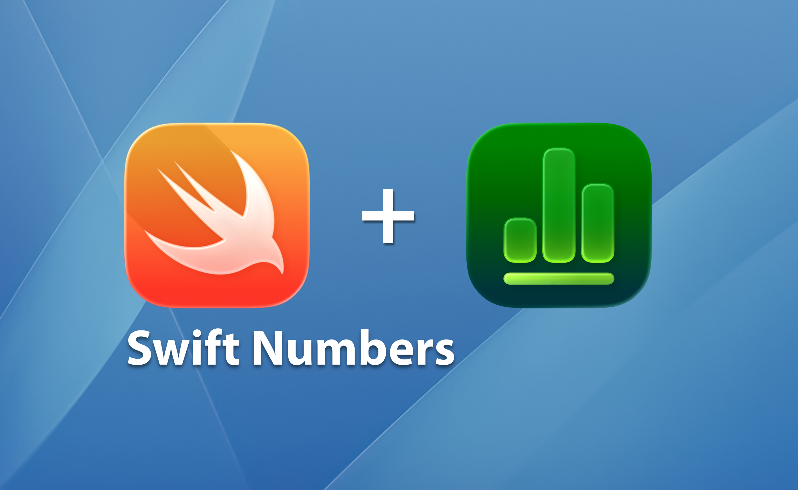

# SwiftNumbers



`SwiftNumbers` is a native Swift library and CLI for reading and editing Apple `.numbers` documents.
It is built as a native stack with a small dependency surface and Swift-first implementation.

## Why SwiftNumbers

- Native Swift stack (`SwiftPM`, macOS 13+)
- Small and focused dependency set, all via Swift Package Manager
- No Python/Node/Ruby runtime dependency in the core workflow
- Read real `.numbers` files (package + single-file archive)
- Deterministic merged table traversal across package and single-file archives
- Edit tabular data and save valid `.numbers` output
- CLI for inspection and automation (`list-sheets`, `list-tables`, `read-cell`, `read-range`, `export-csv`, `import-csv`, `dump`, `inspect`)
- Structured diagnostics for safer debugging
- Table presentation metadata surfaced in CLI JSON (`tableNameVisible`, `captionVisible`, `captionText`, `captionTextSupported`)

## Documentation

Start here: [Docs Hub](docs/index.md)

- Setup: [Quickstart](docs/quickstart.md)
- Full behavior/operations: [Capabilities](docs/capabilities.md)
- Exact signatures/types: [API Reference](docs/api-reference.md)
- Practical workflows: [Cookbook](docs/cookbook.md)
- CLI usage: [CLI Reference](docs/cli-reference.md)
- Prebuilt CLI distribution via Homebrew tap: [Homebrew Distribution](docs/homebrew-distribution.md)
- Failure handling: [Troubleshooting](docs/troubleshooting.md)
- Internal design: [Architecture](docs/architecture.md)

## Install (Homebrew, prebuilt binary)

After publishing a Homebrew tap formula:

```bash
brew install <github-user>/tap/swiftnumbers
```

This installs a prebuilt binary release asset for the current macOS architecture, so users do not need to compile locally.

## Install (SwiftPM library dependency)

```swift
.package(url: "https://github.com/pizzamoltobene/swift-numbers.git", from: "0.4.0")
```

```swift
.product(name: "SwiftNumbers", package: "swift-numbers")
```

## Quick Start

```bash
swift build
swift test
swift run swiftnumbers list-sheets Tests/Fixtures/multi-sheet.numbers
swift run swiftnumbers list-tables Tests/Fixtures/multi-sheet.numbers --format json
swift run swiftnumbers list-formulas Tests/Fixtures/simple-table.numbers --format json
swift run swiftnumbers read-column Tests/Fixtures/simple-table.numbers 0 --sheet "Sheet 1" --table "Table 1" --from-row 1 --format json
swift run swiftnumbers read-column Tests/Fixtures/simple-table.numbers --header "Name" --sheet "Sheet 1" --table "Table 1" --format json
swift run swiftnumbers read-column Tests/Fixtures/simple-table.numbers --header "Name" --sheet "Sheet 1" --table "Table 1" --jsonl
swift run swiftnumbers read-column Tests/Fixtures/simple-table.numbers 1 --sheet "Sheet 1" --table "Table 1" --formulas --format json
swift run swiftnumbers read-table Tests/Fixtures/simple-table.numbers --sheet "Sheet 1" --table "Table 1" --from-row 1 --from-column 0 --max-rows 2 --max-columns 2 --format json
swift run swiftnumbers read-table Tests/Fixtures/simple-table.numbers --sheet "Sheet 1" --table "Table 1" --from-row 1 --from-column 0 --max-rows 2 --max-columns 2 --jsonl
swift run swiftnumbers read-table Tests/Fixtures/simple-table.numbers --sheet "Sheet 1" --table "Table 1" --from-row 1 --from-column 0 --max-rows 2 --max-columns 2 --formatting --format json
swift run swiftnumbers read-cell Tests/Fixtures/simple-table.numbers A1 --sheet "Sheet 1" --table "Table 1" --format json
swift run swiftnumbers read-cell Tests/Fixtures/multi-sheet.numbers A1 --sheet-index 1 --table-index 1 --format json
swift run swiftnumbers read-range Tests/Fixtures/simple-table.numbers A2:B3 --sheet "Sheet 1" --table "Table 1" --format json
swift run swiftnumbers read-range Tests/Fixtures/simple-table.numbers A2:B3 --sheet "Sheet 1" --table "Table 1" --jsonl
swift run swiftnumbers read-range Tests/Fixtures/simple-table.numbers A2:B3 --sheet "Sheet 1" --table "Table 1" --formulas --format json
swift run swiftnumbers export-csv Tests/Fixtures/simple-table.numbers --sheet "Sheet 1" --table "Table 1" --mode value
swift run swiftnumbers import-csv Tests/Fixtures/simple-table.numbers /absolute/path/input.csv --sheet "Sheet 1" --table "Table 1" --header with-header --rename "Amount:Total" --delete-column "Notes" --transform "Signed=neg:Delta" --parse-dates --date-column "When" --date-format "dd/MM/yyyy" --day-first --output /absolute/path/output.numbers
swift run swiftnumbers dump Tests/Fixtures/simple-table.numbers --format json --cells --formatting
swift run swiftnumbers inspect Tests/Fixtures/simple-table.numbers --format json --redact --compact
```

## Minimal Example

```swift
import SwiftNumbersCore

let editable = try EditableNumbersDocument.open(at: inputURL)
let sheet = try editable.sheet(named: "Sales")
let table = try sheet.table(named: "Q1")

try table.setValue(.number(1499.99), at: "D4")
try table.setStyle(
  ReadCellStyle(fontName: "HelveticaNeue", fontSize: 13, isBold: true, textColorHex: "#112233"),
  at: "D4"
)
try table.setFormat(.currency(formatID: 202), at: "D4")
try table.setBorder(true, side: .bottom, at: "D4")
try table.mergeCells("D4:E4")
try table.unmergeCells("D4:E4")
try editable.save(to: outputURL)
```

## Scope Snapshot

### Supported Operations

| Area | Operations (examples from code) | Status | Notes |
|---|---|---|---|
| Document open and introspection | `NumbersDocument.open`, `sheet(named:)`, `sheet(at:)`, `tableNames`, `dump`, `renderDump` | Supported | Real-read pipeline with structured diagnostics; unsupported decode warnings are deduplicated by object/node type; pivot diagnostics include per-candidate (`resolver.pivot.candidateDetected`) and aggregate (`resolver.pivot.candidateSummary`) stable count/ID summaries |
| Cell and table read API | `cell`, `readCell`, `readValue`, `formula`, `formulaResult`, `rows/readRows/readValues`, `column`, `values(in:)`, `readCells(in:)` | Supported | Typed read models and A1/range-based extraction |
| Typed decode and formatting | `value(_:at:)`, `optionalValue(_:at:)`, `decodeRows(as:)`, `formattedValue(...)` | Supported | Deterministic formatting modes and typed access |
| Grouped read surface | `categorizedRows(by:)`, `categorizedValues(by:)` | Supported | Read-only grouped/category output |
| Editable document lifecycle | `EditableNumbersDocument.open`, `save(to:)`, `saveInPlace()`, `addSheet`, `addTable` | Supported | Native save path with dirty-state tracking |
| Cell-level mutations | `setValue`, `setStyle`, `setFormat`, `setBorder`, `applyStyle`, `applyCustomFormat` | Supported | Includes style/format/border roundtrip paths |
| Table structure and layout mutations | `appendRow`, `insertRow`, `appendColumn`, `deleteRow`, `deleteColumn`, `setHeaderRowCount`, `setHeaderColumnCount`, `setRowHeight`, `setColumnWidth` | Supported | Bounds validation and deterministic updates |
| Merge and presentation metadata | `mergeCells`, `unmergeCells`, `setTableNameVisible`, `setCaptionVisible`, `setCaptionText` | Supported | Presentation metadata persisted where storage exists |
| Document registries | `registerStyle`, `registeredStyles`, `registerCustomFormat`, `registeredCustomFormats` | Supported | Reusable style/custom-format registry APIs |
| CLI inspection | `list-sheets`, `list-tables`, `list-formulas`, `read-cell`, `read-column`, `read-table`, `read-range`, `dump`, `inspect` | Supported | `text/json`, `--jsonl` on column/table/range reads, parity switches `--formulas` / `--formatting` on read-column/read-table/read-range, low-level inspection (`--redact`, `--compact`) |
| CLI data transfer | `export-csv`, `import-csv` | Supported | Sheet/table selectors, header mode, date parsing |
| Safety guards | Grouped/pivot-linked mutation protection (`groupedTableMutationUnsupported`, `pivotLinkedTableMutationUnsupported`) + formula write safety validation | Supported | Unsafe structural writes are blocked with clear errors; grouped delete diagnostics include operation index context; pivot-linked guard errors include linked object identifiers for triage; unsafe formula references (sheet-qualified/self-referential single-cell or range references) are rejected deterministically |

### On Roadmap

| Area | Current direction |
|---|---|
| Advanced formulas | Broader compatibility and behavior coverage beyond current deterministic formula workflows |
| Pivot tables | Deeper pivot read coverage and safer, broader pivot-related write semantics |
| Formatting/layout parity | Wider fidelity for complex layout/styling scenarios |
| Non-tabular objects | Incremental support around charts/comments/filters/sorts |
| Interop and tooling | Expanded diagnostics and interoperability workflows |
| Autonomous parity queueing | Deterministic roadmap queue scoring from code capability map signals |

For the exact matrix, use [Capabilities](docs/capabilities.md).

## License

`AGPL-3.0` ([LICENSE-AGPL-3.0](LICENSE-AGPL-3.0))
