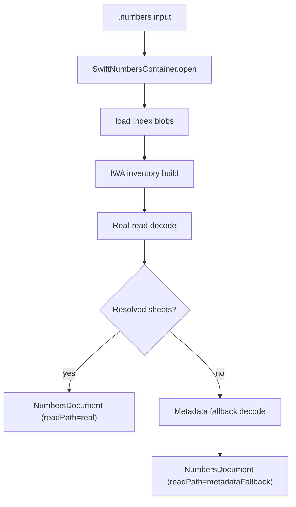
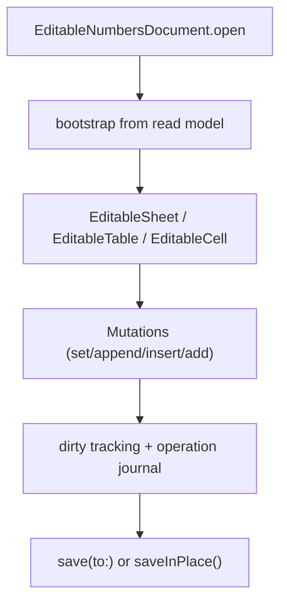

# Architecture

High-level architecture for the current `SwiftNumbers` release line.

## Module Layout

| Module | Responsibility |
|---|---|
| `SwiftNumbersCore` | Public data model, read API, editable API, save orchestration |
| `SwiftNumbersContainer` | Open/copy package or archive `.numbers` container |
| `SwiftNumbersIWA` | IWA inventory, graph traversal, decode, low-level write graph paths |
| `SwiftNumbersProto` | Typed protobuf subset and metadata model interop |
| `swiftnumbers` | CLI entry points (`dump`, `list-sheets`) |

## Read Path

## Editable Path

## Writer Strategy

Primary strategy in the current release line:

- native Swift low-level IWA write path

Safety-net behavior:

- metadata-overlay fallback remains available when low-level path cannot safely handle a source layout

## Dirty Tracking Model

`DocumentDirtyState`:

- `clean`
- `dataDirty`
- `structureDirty`

Transition behavior:

- `setValue` usually moves `clean -> dataDirty`
- structural mutations (`appendRow`, `insertRow`, `appendColumn`, `addSheet`, `addTable`) move to `structureDirty`

## Public Model Layers

### Read model

- immutable `NumbersDocument`
- immutable `Sheet` / `Table` / `TableMetadata`
- sparse cell representation via `[CellAddress: CellValue]`

### Editable model

- reference-type `EditableNumbersDocument`
- mutable `EditableSheet` / `EditableTable` / `EditableCell`
- operation journal for save execution

## Save Semantics

`save(to:)`:

- writes to destination path
- same-path target triggers atomic replace flow
- after successful write, destination becomes the new working baseline
- no-change write to a new path copies current working container

`saveInPlace()`:

- explicit current-working-path replacement API
- temp file + atomic swap strategy

## Diagnostics Model

Operational diagnostics are surfaced via:

- `DocumentDump.readPath`
- `DocumentDump.fallbackReason`
- `DocumentDump.diagnostics`

Typical diagnostic classes:

- version compatibility warnings
- resolver selection/fallback events
- decode anomalies and patching notes

## Non-goals

- formula semantics
- pivots/charts/comments/advanced formatting fidelity
- encrypted document support

## Suggested extension points

For future releases:

1. Extend typed decode coverage in `SwiftNumbersIWA`.
2. Expand low-level writer coverage and shrink fallback use.
3. Add richer metadata/style preservation where required.

## Related docs

- [Capabilities](capabilities.md)
- [Cookbook](cookbook.md)
- [Troubleshooting](troubleshooting.md)
