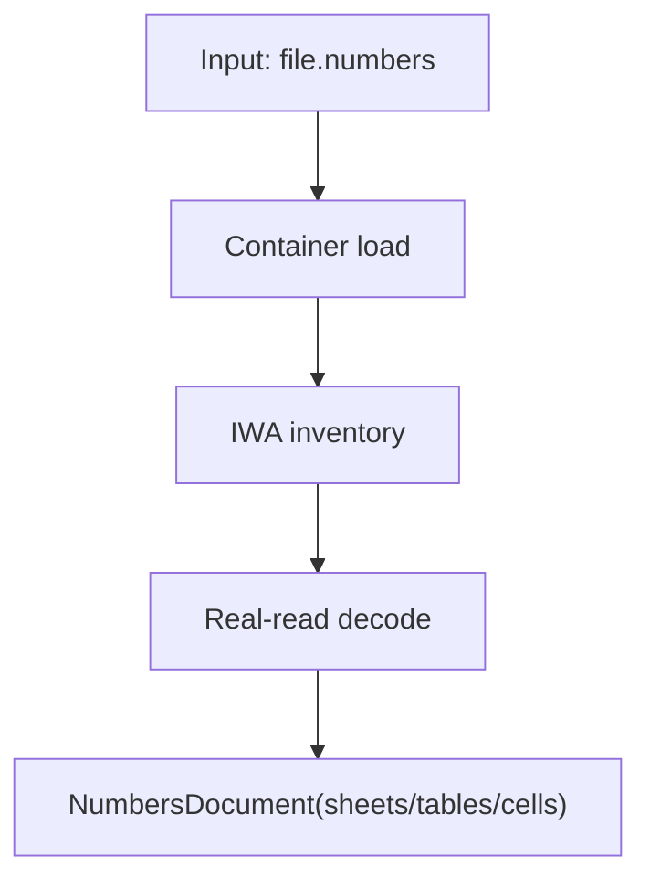
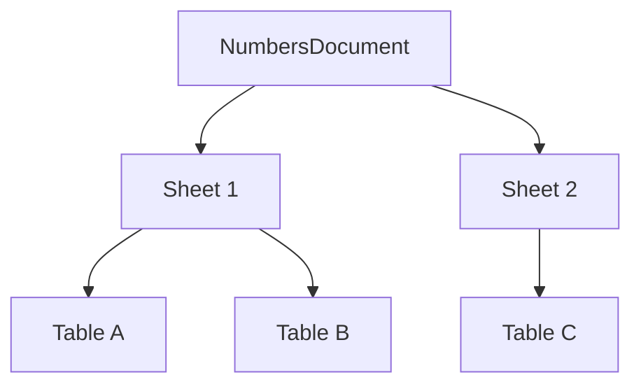
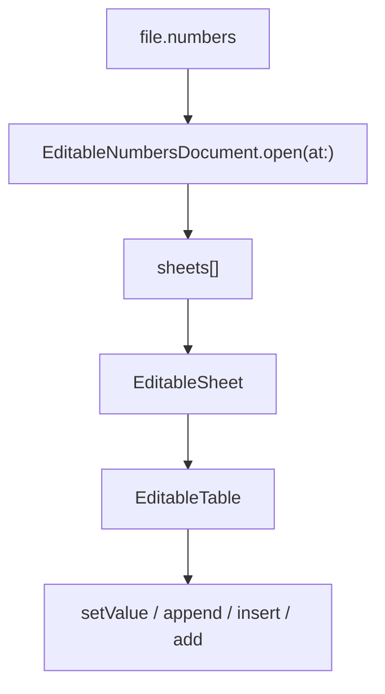
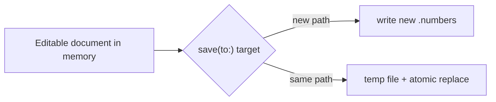
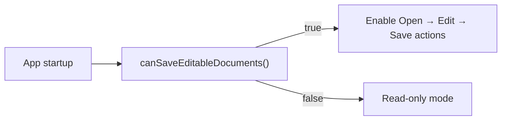
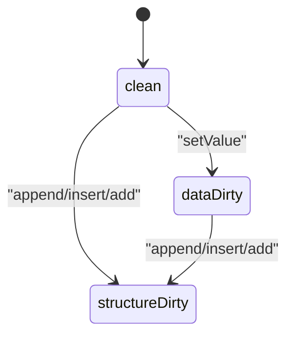

# SwiftNumbers Capabilities (v0.2.2.1)

This document is the full capability reference for `SwiftNumbers` `v0.2.2.1`.

## 0) How to Read This Document

Use this file in two modes:

- **Fast mode (3-5 min):** sections `1`, `3`, `5` operation cards, and `10`.
- **Deep mode:** read top-to-bottom, including pipeline and error sections.

Recommended flow:

1. Scope and support matrix (`1-3`)
2. Data model and value semantics (`4`)
3. Operation-by-operation guide (`5`)
4. Runtime behavior and diagnostics (`6-8`)
5. Quality baseline and boundaries (`9-11`)

Quick jump:

- Open/read basics: section `5.1` to `5.6`
- Editable operations: section `5.7` to `5.17`
- CLI: section `5.18` and `5.19`
- State helpers and typed references: section `5.20` to `5.25`

## 1) Scope Summary

`SwiftNumbers` is a Swift-native library and CLI for Apple Numbers documents:

- open and inspect real `.numbers` containers
- read sheets/tables/cells/merges/metadata
- edit tabular data
- save valid output `.numbers` documents

The focus is reliable tabular data workflows, not full Numbers feature parity.

## 2) Platform, Toolchain, and Products

- Swift tools: `6.0+`
- Platform target: macOS `13+`
- Runtime dependencies: Swift-only (no runtime Python dependency)

Package products:

- `SwiftNumbers` (library product)
- `SwiftNumbersCore` (library target)
- `swiftnumbers` (CLI executable)

Core internal modules:

- `SwiftNumbersCore`: public model + read/edit APIs
- `SwiftNumbersContainer`: `.numbers` package/archive container access
- `SwiftNumbersIWA`: IWA object inventory/traversal/decode/write patching
- `SwiftNumbersProto`: typed protobuf subset used by reader/writer

## 3) Capability Matrix

| Area | Status in v0.2.2.1 | Notes |
|---|---|---|
| Open package `.numbers` | Supported | Reads `Index.zip` package form |
| Open single-file archive `.numbers` | Supported | Reads embedded `Index`/`Index.zip` |
| Read sheets/tables/cells | Supported | Real-read first, metadata fallback as needed |
| Read merge ranges | Supported | Exposed via `Table.metadata.mergeRanges` |
| CLI `dump` and `list-sheets` | Supported | Text and JSON modes |
| Edit cell values | Supported | `string`, `number`, `bool`, `empty`, `date` |
| Append/insert rows | Supported | Low-level IWA path |
| Append columns | Supported | Low-level IWA path |
| Add sheet/table | Supported | Low-level IWA path |
| Save to new path | Supported | `save(to:)` |
| Save in place | Supported | in-place on current working path (`save(to: samePath)` or `saveInPlace()`) |
| Formulas/pivots/charts/etc. | Out of scope | See section 10 |

## 4) Public Data Model

### 4.1 Core Types

- `CellAddress(row: Int, column: Int)` (zero-based)
- `CellReference("A1")` (A1 notation)
- `CellValue`:
  - `.string(String)`
  - `.number(Double)`
  - `.bool(Bool)`
  - `.empty`
  - `.date(Date)`
- `MergeRange`
- `TableMetadata` (`rowCount`, `columnCount`, `mergeRanges`)
- `Table`
- `Sheet`
- `NumbersDocument`
- `EditableNumbersDocument`
- `EditableSheet`
- `EditableTable`
- `EditableCell`
- `EditableNumbersError`
- `DocumentDirtyState` (`clean`, `dataDirty`, `structureDirty`)
- `DocumentDump`

### 4.2 Read Path and Diagnostics

`DocumentDump.readPath` values:

- `real`
- `metadataFallback`

`DocumentDump` fields include:

- source path
- document version (from `Metadata/Properties.plist`, if available)
- blob/object/reference/root counts
- resolved cell count
- fallback reason
- type histogram
- unparsed blob paths
- diagnostics

### 4.3 `CellValue` Semantics and Payloads

| Case | Payload | Typical use | Read support | Write support |
|---|---|---|---|---|
| `.empty` | none | clear a cell / logical blank | Yes | Yes |
| `.string(String)` | UTF-8 text | labels, IDs, free text | Yes | Yes |
| `.number(Double)` | IEEE-754 double | amounts, metrics, numeric features | Yes | Yes |
| `.bool(Bool)` | boolean | flags, pass/fail, on/off | Yes | Yes |
| `.date(Date)` | Foundation `Date` | date/time values | Yes | Yes (stable SwiftNumbers date marker) |

Example:

```swift
table.setValue(.string("Invoice #123"), at: "A1")
table.setValue(.number(1499.95), at: "B1")
table.setValue(.bool(true), at: "C1")
table.setValue(.date(Date()), at: "D1")
table.setValue(.empty, at: "E1")
```

## 5) Operation Playbook (Visual + Attributes)

This section gives operation-by-operation examples with:

- signature
- attributes
- return/errors
- side effects
- visual before/after snapshots
- practical Swift snippet you can run immediately

### Visual Legend

- Tables are shown as `A/B/C...` columns and `1/2/3...` rows.
- `·` means empty cell.
- Coordinates in API are zero-based unless A1 is explicitly used.

### Operation Catalog

| Group | Operations |
|---|---|
| Read open/introspection | `open`, `sheets`, `tables`, `metadata`, `cell(at:)`, `dump`, `renderDump` |
| Editable open/navigation | `EditableNumbersDocument.open`, `sheet(named:)`, `table(named:)`, `cell(_:)`, `cell(at: CellReference)` |
| Editable mutation | `setValue`, `appendRow`, `insertRow`, `appendColumn`, `addTable`, `addSheet` |
| Save | `save(to:)`, `saveInPlace()` |
| Runtime capability/state | `canSaveEditableDocuments`, `hasChanges`, `dirtyState`, `firstSheet`, `firstTable` |
| CLI | `swiftnumbers list-sheets`, `swiftnumbers dump` |

### Task-to-Operation Cheat Sheet

| I want to... | Operation(s) | Notes |
|---|---|---|
| Inspect file structure quickly | `dump()`, `renderDump()`, CLI `dump` | Includes diagnostics and read path |
| List all sheets | `sheets`, CLI `list-sheets` | JSON mode is script-friendly |
| Read one value | `cell(at:)` | Read-only `Table` API |
| Edit one value by A1 | `setValue(_:at: String)` | Throws on invalid A1 |
| Edit one value by indices | `setValue(_:at: CellAddress)` | Zero-based row/column |
| Add more records | `appendRow(_:)` | Grows row count |
| Insert records at position | `insertRow(_:at:)` | Shifts rows below |
| Add a derived column | `appendColumn(_:)` | Grows column count |
| Add a new report table | `addTable(...)` | Target sheet must exist; duplicate table names in the same sheet are rejected |
| Add a new sheet | `addSheet(named:)` | Creates default `Table 1`; duplicate sheet names are auto-suffixed |
| Save as new file | `save(to:)` with new path | Source remains untouched |
| Replace current working file | `saveInPlace()` | Atomic replace |

---

### 5.1 `NumbersDocument.open(at:)`

**Purpose**

Open a `.numbers` file and build the read model.

**Signature**

```swift
static func open(at url: URL) throws -> NumbersDocument
```

**Attributes**

| Attribute | Type | Required | Notes |
|---|---|---|---|
| `url` | `URL` | Yes | Path to package or single-file archive `.numbers` |

**Returns**

- `NumbersDocument`

**Throws**

- container/path/archive parse errors
- malformed IWA parse failures

**Side Effects**

- none on disk

**Visual**



**Example**

```swift
let doc = try NumbersDocument.open(at: inputURL)
print(doc.sheets.count)
```

---

### 5.2 `NumbersDocument.sheets`

**Purpose**

Access all sheets in read model order.

**Attributes**

| Attribute | Type | Required | Notes |
|---|---|---|---|
| `sheets` | `[Sheet]` | n/a | Read-only collection |

**Visual**



**Example**

```swift
for sheet in doc.sheets {
  print(sheet.name)
}
```

---

### 5.3 `Sheet.tables`

**Purpose**

Read tables available on a sheet.

**Attributes**

| Attribute | Type | Required | Notes |
|---|---|---|---|
| `tables` | `[Table]` | n/a | Read-only |

**Visual**

Before:

|   | A | B |
|---|---|---|
| 1 | Item | Qty |
| 2 | Pen | 5 |

After calling `sheet.tables`: no mutation, same data.

---

### 5.4 `Table.metadata`

**Purpose**

Get structural metadata for a table.

**Attributes**

| Field | Type | Notes |
|---|---|---|
| `rowCount` | `Int` | Logical row count |
| `columnCount` | `Int` | Logical column count |
| `mergeRanges` | `[MergeRange]` | Merge areas if present |

**Visual**

```text
Table: Q1
rows=4, cols=3
mergeRanges:
  [row:0...0, col:0...1]   // A1:B1 merged
```

**Example**

```swift
let m = table.metadata
print(m.rowCount, m.columnCount, m.mergeRanges.count)
```

---

### 5.5 `Table.cell(at:)`

**Purpose**

Read the value at a zero-based address.

**Signature**

```swift
func cell(at address: CellAddress) -> CellValue?
```

**Attributes**

| Attribute | Type | Required | Notes |
|---|---|---|---|
| `address.row` | `Int` | Yes | Zero-based row |
| `address.column` | `Int` | Yes | Zero-based column |

**Returns**

- `CellValue?` (`nil` when absent)

**Visual**

|   | A | B | C |
|---|---|---|---|
| 1 | Item | Qty | Done |
| 2 | Pen | 5 | false |

`cell(at: .init(row: 1, column: 1)) -> .number(5)`

---

### 5.6 `NumbersDocument.dump()` and `renderDump()`

**Purpose**

Get operational introspection data (metrics + diagnostics).

**Signatures**

```swift
func dump() -> DocumentDump
func renderDump() -> String
```

**Attributes (selected `DocumentDump`)**

| Field | Type | Meaning |
|---|---|---|
| `readPath` | `DocumentReadPath` | `real` or `metadataFallback` |
| `fallbackReason` | `String?` | Why fallback happened |
| `resolvedCellCount` | `Int` | Parsed populated cells |
| `diagnostics` | `[String]` | Human-readable diagnostics |

**Visual**

```text
Source: /path/file.numbers
Read path: real
Sheets: 3
Tables: 5
Resolved cells: 1200
Diagnostics: 1
```

---

### 5.7 `EditableNumbersDocument.open(at:)`

**Purpose**

Open a document in mutable mode.

**Signature**

```swift
static func open(at url: URL) throws -> EditableNumbersDocument
```

**Attributes**

| Attribute | Type | Required | Notes |
|---|---|---|---|
| `url` | `URL` | Yes | Existing `.numbers` path |

**Returns**

- editable document with mutation APIs

**Visual**



**Example**

```swift
let editable = try EditableNumbersDocument.open(at: inputURL)
print(editable.sheets.count)
```

---

### 5.8 `sheet(named:)` / `table(named:)`

**Purpose**

Resolve mutable sheet/table by name.

**Signatures**

```swift
func sheet(named: String) throws -> EditableSheet
func table(named: String) throws -> EditableTable
```

**Attributes**

| Attribute | Type | Required | Notes |
|---|---|---|---|
| `name` | `String` | Yes | Exact match in current model |

**Throws**

- `sheetNotFound`
- `tableNotFound`

**Visual**

```text
Document
  ├─ Sheet "Sales"
  │   ├─ Table "Q1"
  │   └─ Table "Forecast"
  └─ Sheet "Archive"

sheet(named: "Sales") -> EditableSheet("Sales")
table(named: "Q1")    -> EditableTable("Q1")
```

**Example**

```swift
let sales = try doc.sheet(named: "Sales")
let q1 = try sales.table(named: "Q1")
print(q1.name)
```

---

### 5.9 `cell(_ reference:)` / `EditableCell.value`

**Purpose**

Convenient A1-based editable accessor.

**Signatures**

```swift
func cell(_ reference: String) throws -> EditableCell
var value: CellValue? { get set }
```

**Attributes**

| Attribute | Type | Required | Notes |
|---|---|---|---|
| `reference` | `String` | Yes | A1 format (`C4`, `AA12`) |

**Throws**

- `invalidCellReference`

**Visual**

Before:

|   | A | B | C |
|---|---|---|---|
| 1 | Item | Qty | Done |
| 2 | Pen | 5 | false |

Operation:

```swift
let c2 = try table.cell("C2")
c2.value = .bool(true)
```

After:

|   | A | B | C |
|---|---|---|---|
| 1 | Item | Qty | Done |
| 2 | Pen | 5 | true |

**Example**

```swift
let c4 = try table.cell("C4")
c4.value = .string("Done")
```

---

### 5.10 `setValue(_:at:)`

**Purpose**

Set a cell value at coordinate or A1 reference.

**Signatures**

```swift
func setValue(_ value: CellValue, at address: CellAddress)
func setValue(_ value: CellValue, at reference: String) throws
```

**Attributes**

| Attribute | Type | Required | Notes |
|---|---|---|---|
| `value` | `CellValue` | Yes | Any supported value type |
| `address` | `CellAddress` | Yes | Zero-based coordinate |
| `reference` | `String` | Yes | A1 coordinate (alt overload) |

**Side Effects**

- marks document dirty
- can grow table bounds if target is outside current size

**Visual (before/after)**

Before:

|   | A | B | C |
|---|---|---|---|
| 1 | Item | Qty | Done |
| 2 | Pen | 5 | false |
| 3 | Pencil | 10 | false |

Operation:

```swift
table.setValue(.bool(true), at: CellAddress(row: 2, column: 2))
```

After:

|   | A | B | C |
|---|---|---|---|
| 1 | Item | Qty | Done |
| 2 | Pen | 5 | false |
| 3 | Pencil | 10 | true |

---

### 5.11 `appendRow(_:)`

**Purpose**

Append a row at end of table.

**Signature**

```swift
func appendRow(_ values: [CellValue])
```

**Attributes**

| Attribute | Type | Required | Notes |
|---|---|---|---|
| `values` | `[CellValue]` | Yes | New row values |

**Side Effects**

- `rowCount += 1`
- may increase `columnCount` if `values.count` is larger

**Visual (before/after)**

Before (`rowCount = 3`):

|   | A | B |
|---|---|---|
| 1 | Name | Score |
| 2 | Alice | 9 |
| 3 | Bob | 7 |

Operation:

```swift
table.appendRow([.string("Carol"), .number(10)])
```

After (`rowCount = 4`):

|   | A | B |
|---|---|---|
| 1 | Name | Score |
| 2 | Alice | 9 |
| 3 | Bob | 7 |
| 4 | Carol | 10 |

---

### 5.12 `insertRow(_:at:)`

**Purpose**

Insert row at index and shift subsequent rows down.

**Signature**

```swift
func insertRow(_ values: [CellValue], at rowIndex: Int) throws
```

**Attributes**

| Attribute | Type | Required | Notes |
|---|---|---|---|
| `values` | `[CellValue]` | Yes | Row payload |
| `rowIndex` | `Int` | Yes | `0...rowCount` |

**Throws**

- `invalidRowIndex`

**Visual (before/after)**

Before:

|   | A | B |
|---|---|---|
| 1 | Name | Score |
| 2 | Alice | 9 |
| 3 | Bob | 7 |

Operation:

```swift
try table.insertRow([.string("Header"), .string("Value")], at: 0)
```

After:

|   | A | B |
|---|---|---|
| 1 | Header | Value |
| 2 | Name | Score |
| 3 | Alice | 9 |
| 4 | Bob | 7 |

---

### 5.13 `appendColumn(_:)`

**Purpose**

Append a new column at the end.

**Signature**

```swift
func appendColumn(_ values: [CellValue])
```

**Attributes**

| Attribute | Type | Required | Notes |
|---|---|---|---|
| `values` | `[CellValue]` | Yes | Values for each row |

**Side Effects**

- `columnCount += 1`
- may increase `rowCount` if `values.count` is larger

**Visual (before/after)**

Before:

|   | A | B |
|---|---|---|
| 1 | Name | Score |
| 2 | Alice | 9 |
| 3 | Bob | 7 |

Operation:

```swift
table.appendColumn([.string("Status"), .string("Pass"), .string("Pass")])
```

After:

|   | A | B | C |
|---|---|---|---|
| 1 | Name | Score | Status |
| 2 | Alice | 9 | Pass |
| 3 | Bob | 7 | Pass |

---

### 5.14 `addTable(named:rows:columns:onSheetNamed:)`

**Purpose**

Create a new table on an existing sheet.

**Signature**

```swift
func addTable(named: String, rows: Int, columns: Int, onSheetNamed: String) throws -> EditableTable
```

**Attributes**

| Attribute | Type | Required | Notes |
|---|---|---|---|
| `name` | `String` | Yes | Table display name |
| `rows` | `Int` | Yes | Initial row count (`>= 0`) |
| `columns` | `Int` | Yes | Initial column count (`>= 0`) |
| `sheetName` | `String` | Yes | Existing target sheet |

**Throws**

- `sheetNotFound`
- `invalidRowIndex`
- `invalidColumnIndex`
- `duplicateTableName` (same sheet)
- `nativeWriteFailed` (ambiguous low-level targeting)

**Visual**

Before (`Sales` has one table):

```text
Sheet: Sales
  - Table: Q1
```

Operation:

```swift
let t = try doc.addTable(named: "Forecast", rows: 2, columns: 3, onSheetNamed: "Sales")
t.setValue(.string("Ready"), at: CellAddress(row: 0, column: 0))
```

After:

```text
Sheet: Sales
  - Table: Q1
  - Table: Forecast
```

---

### 5.15 `addSheet(named:)`

**Purpose**

Create a new sheet with default `Table 1`.

**Signature**

```swift
@discardableResult
func addSheet(named: String) -> EditableSheet
```

**Attributes**

| Attribute | Type | Required | Notes |
|---|---|---|---|
| `name` | `String` | Yes | New sheet name |

**Side Effects**

- adds a sheet
- creates default `Table 1` with `1x1`
- if name already exists, auto-suffixes (`Name`, `Name (2)`, ...)

**Visual**

Before:

```text
Sheets: [Sales, Marketing]
```

Operation:

```swift
let newSheet = doc.addSheet(named: "Archive")
try newSheet.table(named: "Table 1").setValue(.string("Seed"), at: "A1")
```

After:

```text
Sheets: [Sales, Marketing, Archive]
Archive contains: Table 1 (1x1)
```

---

### 5.16 `save(to:)`

**Purpose**

Persist all mutations to disk.

**Signature**

```swift
func save(to outputURL: URL) throws
```

**Attributes**

| Attribute | Type | Required | Notes |
|---|---|---|---|
| `outputURL` | `URL` | Yes | New destination or same-path in-place |

**Behavior**

- if `outputURL` equals current working path: performs atomic in-place replace
- if `outputURL` is a different path: writes a new document and sets that path as the new working path
- if no changes and `outputURL` is a different path: copies current working container
- repeated saves continue from the latest successful working path

**Visual**



---

### 5.17 `saveInPlace()`

**Purpose**

Explicit in-place persist with atomic replace semantics.

**Signature**

```swift
func saveInPlace() throws
```

**Attributes**

| Attribute | Type | Required | Notes |
|---|---|---|---|
| n/a | n/a | n/a | Operates on current working path |

**Behavior**

- writes to temp path
- atomically replaces current working file
- no-op if there are no pending changes

**Visual**


**Example**

```swift
table.setValue(.number(99), at: .init(row: 1, column: 1))
try doc.saveInPlace()
```

---

### 5.18 `swiftnumbers list-sheets`

**Purpose**

Print sheet list quickly from CLI.

**Command**

```bash
swiftnumbers list-sheets <file.numbers> [--format text|json]
```

**Attributes**

| Attribute | Type | Required | Notes |
|---|---|---|---|
| `<file.numbers>` | path | Yes | Input `.numbers` |
| `--format` | `text`/`json` | No | Default `text` |

**Visual output (text)**

```text
1. Sales
2. Archive
```

**Visual output (json)**

```json
{
  "sheets": [
    { "index": 1, "id": "sheet-...", "name": "Sales", "tableCount": 2 },
    { "index": 2, "id": "sheet-...", "name": "Archive", "tableCount": 1 }
  ]
}
```

---

### 5.19 `swiftnumbers dump`

**Purpose**

Inspect read path, inventory, diagnostics, and table summaries.

**Command**

```bash
swiftnumbers dump <file.numbers> [--format text|json]
```

**Attributes**

| Attribute | Type | Required | Notes |
|---|---|---|---|
| `<file.numbers>` | path | Yes | Input `.numbers` |
| `--format` | `text`/`json` | No | Default `text` |

**Visual output (text, abbreviated)**

```text
Read path: real
Sheets: 2
Tables: 3
Resolved cells: 420
Diagnostics: 0
```

**Visual output (json, abbreviated)**

```json
{
  "readPath": "real",
  "sheetCount": 2,
  "tableCount": 3,
  "resolvedCellCount": 420,
  "diagnostics": []
}
```

---

### 5.20 `EditableNumbersDocument.canSaveEditableDocuments()`

**Purpose**

Runtime capability flag for write support availability.

**Signature**

```swift
static func canSaveEditableDocuments() -> Bool
```

**Attributes**

| Attribute | Type | Required | Notes |
|---|---|---|---|
| n/a | n/a | n/a | Static capability check |

**Returns**

- `Bool`

**Visual**



**Example**

```swift
guard EditableNumbersDocument.canSaveEditableDocuments() else {
  print("Write mode unavailable")
  return
}
```

---

### 5.21 `EditableNumbersDocument` state properties

**Purpose**

Observe in-memory edit state and sheet collection.

**Properties**

```swift
var sheets: [EditableSheet] { get }
var firstSheet: EditableSheet? { get }
var hasChanges: Bool { get }
var dirtyState: DocumentDirtyState { get }
```

**Attributes**

| Property | Type | Meaning |
|---|---|---|
| `sheets` | `[EditableSheet]` | Full mutable sheet list |
| `firstSheet` | `EditableSheet?` | Convenience accessor |
| `hasChanges` | `Bool` | `true` when edit journal is not empty |
| `dirtyState` | `DocumentDirtyState` | `clean` / `dataDirty` / `structureDirty` |

**Visual (state transition)**



**Example**

```swift
let doc = try EditableNumbersDocument.open(at: url)
print(doc.dirtyState.rawValue)  // clean
let table = try doc.sheet(named: "Sales").table(named: "Q1")
table.setValue(.number(42), at: .init(row: 1, column: 1))
print(doc.hasChanges)           // true
print(doc.dirtyState.rawValue)  // dataDirty
```

---

### 5.22 `EditableSheet.tables` and `EditableSheet.firstTable`

**Purpose**

Traverse mutable tables inside one sheet.

**Properties**

```swift
var tables: [EditableTable] { get }
var firstTable: EditableTable? { get }
```

**Attributes**

| Property | Type | Meaning |
|---|---|---|
| `tables` | `[EditableTable]` | Mutable table list in the sheet |
| `firstTable` | `EditableTable?` | Convenience accessor for quick workflows |

**Visual**

```text
Sheet: Sales
  tables[0] -> "Q1"
  tables[1] -> "Forecast"
  firstTable -> "Q1"
```

**Example**

```swift
let sheet = try doc.sheet(named: "Sales")
if let table = sheet.firstTable {
  print(table.name)
}
```

---

### 5.23 `EditableTable.metadata` and `EditableTable.populatedCellCount`

**Purpose**

Inspect live structural stats for mutable tables.

**Properties**

```swift
var metadata: TableMetadata { get }
var populatedCellCount: Int { get }
```

**Attributes**

| Property | Type | Meaning |
|---|---|---|
| `metadata.rowCount` | `Int` | Current logical row count |
| `metadata.columnCount` | `Int` | Current logical column count |
| `metadata.mergeRanges` | `[MergeRange]` | Current merge map |
| `populatedCellCount` | `Int` | Non-empty cells currently stored |

**Visual (before/after `appendRow`)**

```text
Before: rows=3 cols=2 populated=6
After : rows=4 cols=2 populated=8
```

**Example**

```swift
let t = try doc.sheet(named: "Sales").table(named: "Q1")
print(t.metadata.rowCount, t.metadata.columnCount, t.populatedCellCount)
```

---

### 5.24 `Table.allCells` and `Table.populatedCellCount` (read model)

**Purpose**

Access full sparse-cell map from read-only model.

**Properties**

```swift
var allCells: [CellAddress: CellValue] { get }
var populatedCellCount: Int { get }
```

**Attributes**

| Property | Type | Meaning |
|---|---|---|
| `allCells` | `[CellAddress: CellValue]` | Sparse dictionary of populated cells |
| `populatedCellCount` | `Int` | Number of stored non-empty cells |

**Visual**

```text
allCells:
  (row:0,col:0) -> "Item"
  (row:0,col:1) -> "Qty"
  (row:1,col:0) -> "Pen"
  (row:1,col:1) -> 5
```

**Example**

```swift
let table = doc.sheets[0].tables[0]
for (address, value) in table.allCells {
  print(address.row, address.column, value)
}
```

---

### 5.25 `CellReference` + `cell(at reference: CellReference)`

**Purpose**

Use typed A1 references and avoid raw string parsing in hot paths.

**Signatures**

```swift
init(_ rawValue: String) throws
init(address: CellAddress)
func cell(at reference: CellReference) -> EditableCell
```

**Attributes**

| Attribute | Type | Required | Notes |
|---|---|---|---|
| `rawValue` | `String` | Yes | A1 coordinate like `B3`, `AA12` |
| `address` | `CellAddress` | Yes | Zero-based coordinate |
| `reference.address` | `CellAddress` | n/a | Parsed row/column |
| `reference.a1` | `String` | n/a | Normalized uppercase A1 text |

**Visual**

| A1 | row | column |
|---|---:|---:|
| `A1` | 0 | 0 |
| `B3` | 2 | 1 |
| `AA10` | 9 | 26 |

**Example**

```swift
let ref = try CellReference("D5")
let editableCell = table.cell(at: ref)
editableCell.value = .string("Ready")
```

## 6) Read Pipeline Behavior

Read strategy in `NumbersDocument.open(at:)`:

1. Parse container + inventory.
2. Run real IWA traversal/decode.
3. If editable overlay metadata is detected, prefer that path.
4. Else if real-read resolved sheets, use real-read.
5. Else fallback to typed metadata decode if metadata exists.

Version handling:

- reads `fileFormatVersion` from `Metadata/Properties.plist`
- emits warning diagnostics for versions outside tested support set
- continues decode in best-effort mode

Structured diagnostics model:

- `code`
- `severity` (`info`, `warning`, `error`)
- `message`
- `context` map

Representative diagnostic codes:

- `version.unsupported`
- `resolver.document.missing`
- `resolver.document.selected`
- `resolver.document.selectionFallback`
- `resolver.document.decodeFailed`
- `resolver.sheet.empty`
- `resolver.sheet.invalidReference`
- `resolver.sheet.duplicateReference`
- `resolver.sheet.decodeMissing`
- `resolver.table.resolveFailed`
- `decode.rowStorage.patched`

## 7) Write Engine Behavior

Primary write engine:

- native low-level IWA patch/write path (Swift only)

Low-level path supports:

- `setValue`
- `appendRow`
- `insertRow`
- `appendColumn`
- `addSheet`
- `addTable`

Safety net behavior:

- metadata-overlay fallback remains available when low-level write cannot safely handle a specific source layout.

## 8) Error Reference

### Read/open side

Common failure sources:

- path/container missing
- invalid zip/archive
- malformed/truncated IWA payload

### Editable API errors (`EditableNumbersError`)

- `sheetNotFound`
- `tableNotFound`
- `invalidCellReference`
- `invalidRowIndex`
- `invalidColumnIndex`
- `nativeWriteFailed`

## 9) Quality and Delivery Baseline

Local quality gate:

- `./scripts/ci-check.sh`
- format check (`swift format` / `swift-format` strict lint)
- warnings-as-errors build
- tests + coverage collection
- first-party coverage threshold (default `>= 70%`)

GitHub CI baseline:

- format-check job
- lint-build job
- tests job
- coverage-summary gate

Release helper:

- `./scripts/release_check_020.sh`
- outputs `.local/release-check-020.json`
- includes manual Apple Numbers smoke-check confirmation step

## 10) Out of Scope for v0.2.2.1

- formulas and formula engine behavior
- pivot/grouped tables
- charts
- comments
- filters/sorts/conditions
- advanced formatting and full layout fidelity parity
- collaborative metadata flows
- encrypted Numbers documents

## 11) Test Assets and Real-File Workflow

Public fixtures:

- `Tests/Fixtures/` synthetic/reference corpus (committed)

Private real-world corpus:

- supported locally through private-corpus scripts
- intentionally excluded from version control

## 12) Related Documentation

- [Docs Hub](index.md)
- [Quickstart](quickstart.md)
- [Operations Index](operations/README.md)
- [API Reference](api-reference.md)
- [Cookbook](cookbook.md)
- [CLI Reference](cli-reference.md)
- [Troubleshooting](troubleshooting.md)
- [Architecture](architecture.md)
