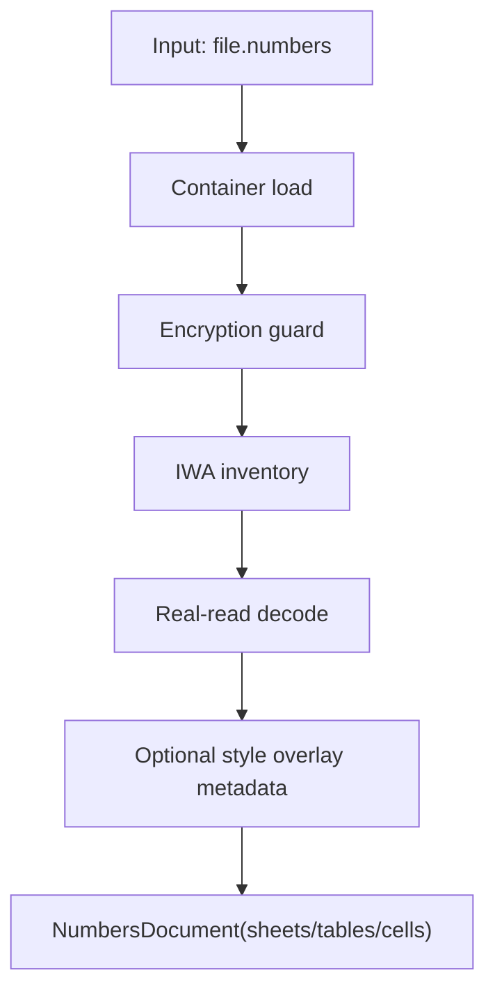
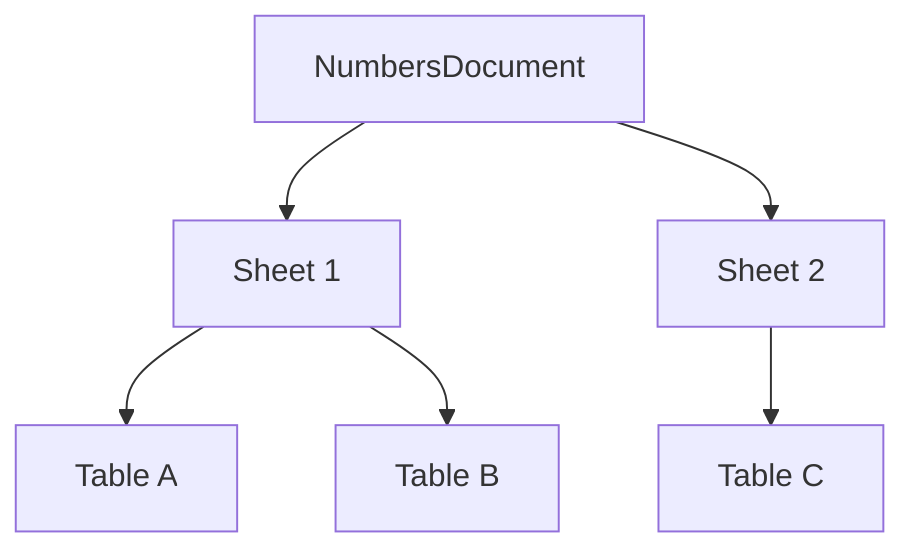
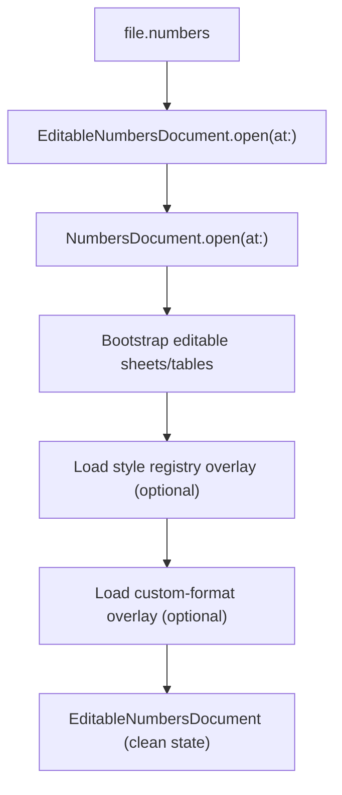
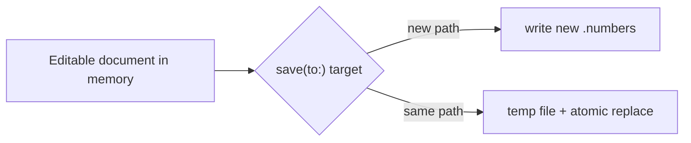
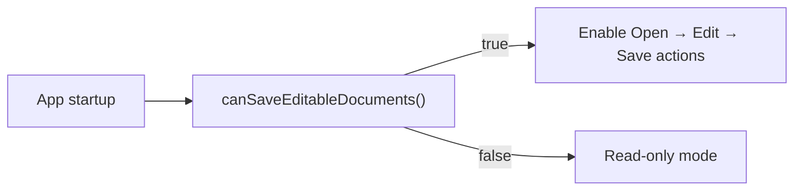
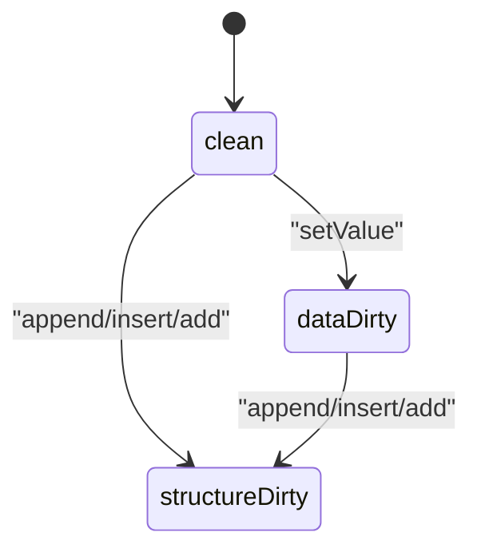

# SwiftNumbers Capabilities

This document is the full capability reference for the current `SwiftNumbers` release line.

## 0) How to Read This Document

Use this file in two modes:

- **Fast mode (3-5 min):** sections `1`, `3`, `5` operation cards, and `10`.
- **Deep mode:** read top-to-bottom, including pipeline and error sections.

Recommended flow:

1. Scope and support matrix (`1-3`)
2. Data model and value semantics (`4`)
3. Operation-by-operation guide (`5`)
4. Runtime behavior and diagnostics (`6-8`)
5. Quality baseline and boundaries (`9-11`)

Quick jump:

- Open/read basics: section `5.1` to `5.6`
- Editable operations: section `5.7` to `5.17`
- CLI: section `5.18` to `5.19`
- State helpers and typed references: section `5.20` to `5.25`

## 1) Scope Summary

`SwiftNumbers` is a Swift-native library and CLI for Apple Numbers documents:

- open and inspect real `.numbers` containers
- read sheets/tables/cells/merges/metadata
- edit tabular data
- save valid output `.numbers` documents

The focus is reliable tabular data workflows, not full Numbers feature parity.

## 2) Platform, Toolchain, and Products

- Swift tools: `6.0+`
- Platform target: macOS `13+`
- Runtime dependencies: Swift-only (no runtime Python dependency)

Package products:

- `SwiftNumbers` (library product)
- `SwiftNumbersCore` (library target)
- `swiftnumbers` (CLI executable)

Core internal modules:

- `SwiftNumbersCore`: public model + read/edit APIs
- `SwiftNumbersContainer`: `.numbers` package/archive container access
- `SwiftNumbersIWA`: IWA object inventory/traversal/decode/write patching
- `SwiftNumbersProto`: typed protobuf subset used by reader/writer

## 3) Capability Matrix

| Area | Status | Notes |
|---|---|---|
| Open package `.numbers` | Supported | Reads `Index.zip` package form |
| Open single-file archive `.numbers` | Supported | Reads embedded `Index`/`Index.zip` |
| Read sheets/tables/cells | Supported | Real-read first with deterministic merged table traversal across package/single-file archives; metadata fallback as needed |
| Read merge ranges | Supported | Exposed via `Table.metadata.mergeRanges` |
| CLI `dump`, `inspect`, `list-sheets`, `list-tables`, `list-formulas`, `read-column`, `read-table`, `read-cell`, `read-range`, `export-csv`, `import-csv`, and `refresh-apple-numbers-map` | Supported | Text/JSON modes for introspection commands (`read-column/read-table/read-range` also support `--jsonl`); `inspect` supports `--redact/--compact`; CSV export/import via `export-csv` / `import-csv`; AppleScript parity map refresh via `refresh-apple-numbers-map`, including read-probe rows for sheet/table/range/row/column/cell semantics |
| Edit cell values | Supported | `string`, `formula`, `number`, `bool`, `empty`, `date` |
| Append/insert rows | Supported | Low-level IWA path; grouped-table unsafe structural edits fail fast with deterministic guidance |
| Append columns | Supported | Low-level IWA path; grouped-table unsafe structural edits fail fast with deterministic guidance |
| Delete rows/columns | Supported | `deleteRow` / `deleteColumn` with deterministic index shifting and bounds validation; grouped-table blocks include actionable operation index context |
| Merge/unmerge ranges | Supported | Editable API supports `mergeCells` and `unmergeCells` with deterministic merge metadata persistence and exact-range unmerge semantics |
| Header and geometry mutations | Supported | `setHeaderRowCount` / `setHeaderColumnCount`, `setRowHeight`, `setColumnWidth` persist through low-level IWA path |
| Table presentation metadata mutations | Supported | `setTableNameVisible`, `setCaptionVisible`, `setCaptionText` persist through low-level IWA path |
| Add sheet/table | Supported | Low-level IWA path |
| Save to new path | Supported | `save(to:)` |
| Save in place | Supported | in-place on current working path (`save(to: samePath)` or `saveInPlace()`) |
| Formula write (basic arithmetic + function refs) | Supported | Formula literals are persisted and round-tripped deterministically (`=A1+B1`, `=SUM(A1:A5)`); unsafe sheet-qualified/self-referential single-cell and range references (including absolute refs like `$B$2`) are rejected with deterministic errors |
| Advanced formula engine + pivots/charts/etc. | Out of scope | Full recalculation engine parity and pivot/chart mutation support remain out of scope |

## 4) Public Data Model

### 4.1 Core Types

- `CellAddress(row: Int, column: Int)` (zero-based)
- `CellReference("A1")` (A1 notation)
- `CellValue`:
  - `.string(String)`
  - `.formula(String)`
  - `.number(Double)`
  - `.bool(Bool)`
  - `.empty`
  - `.date(Date)`
- `MergeRange`
- `TableMetadata` (`rowCount`, `columnCount`, `headerRowCount`, `headerColumnCount`, `rowHeights`, `columnWidths`, `mergeRanges`, optional stable object IDs, optional pivot link metadata)
- `Table`
- `Sheet`
- `NumbersDocument`
- `EditableNumbersDocument`
- `EditableSheet`
- `EditableTable`
- `EditableCell`
- `EditableNumbersError`
- `DocumentDirtyState` (`clean`, `dataDirty`, `structureDirty`)
- `DocumentDump`

### 4.2 Read Path and Diagnostics

`DocumentDump.readPath` values:

- `real`
- `metadataFallback`

`DocumentDump` fields include:

- source path
- document version (from `Metadata/Properties.plist`, if available)
- blob/object/reference/root counts
- resolved cell count
- fallback reason
- type histogram
- unparsed blob paths
- diagnostics

### 4.3 `CellValue` Semantics and Payloads

| Case | Payload | Typical use | Read support | Write support |
|---|---|---|---|---|
| `.empty` | none | clear a cell / logical blank | Yes | Yes |
| `.string(String)` | UTF-8 text | labels, IDs, free text | Yes | Yes |
| `.formula(String)` | formula literal | arithmetic/function expressions (`=A1+B1`, `=SUM(A1:A5)`) | Yes | Yes (stored via deterministic SwiftNumbers formula marker) |
| `.number(Double)` | IEEE-754 double | amounts, metrics, numeric features | Yes | Yes |
| `.bool(Bool)` | boolean | flags, pass/fail, on/off | Yes | Yes |
| `.date(Date)` | Foundation `Date` | date/time values | Yes | Yes (stable SwiftNumbers date marker) |

Example:

```swift
table.setValue(.string("Invoice #123"), at: "A1")
table.setValue(.formula("=SUM(B2:B10)"), at: "B1")
table.setValue(.number(1499.95), at: "C1")
table.setValue(.bool(true), at: "D1")
table.setValue(.date(Date()), at: "E1")
table.setValue(.empty, at: "F1")
try table.setStyle(ReadCellStyle(fontName: "HelveticaNeue", isBold: true), at: "A1")
```

## 5) Operation Playbook (Visual + Attributes)

This section gives operation-by-operation examples with:

- signature
- attributes
- return/errors
- side effects
- visual before/after snapshots
- practical Swift snippet you can run immediately

### Visual Legend

- Tables are shown as `A/B/C...` columns and `1/2/3...` rows.
- `·` means empty cell.
- Coordinates in API are zero-based unless A1 is explicitly used.

### Operation Catalog

| Group | Operations |
|---|---|
| Read open/introspection | `open`, `sheets`, `firstSheet`, `sheet(named:)`, `sheet(at:)`, `tables`, `firstTable`, `table(named:)`, `table(at:)`, `metadata`, `cell(at:)`, `cell(row:column:)`, `cell("A1")`, `readCell(...)`, `readValue(...)`, `formula(...)`, `formulas()`, `formulaResult(...)`, `rows()/rows(valuesOnly:)/rows(lazy:)`, `readRows()/readRows(lazy:)`, `readValues()/readValues(lazy:)`, `categorizedRows(by:)`, `categorizedValues(by:)`, `column(named:)`, `values(in:)`, `decodeRows(as:)`, typed `value(_:at:)`, `formattedValue(...)`, `rowHeight(...)`, `columnWidth(...)`, `cellGeometry(...)`, `mergeRange(...)`, `isMergedCell(...)`, `dump`, `renderDump` |
| Editable open/navigation | `EditableNumbersDocument.open`, `sheet(named:)`, `table(named:)`, `cell(_:)`, `cell(at: CellReference)` |
| Editable registries | `registerStyle`, `registeredStyles`, `registeredStyle(id:)`, `registerCustomFormat`, `registeredCustomFormats`, `registeredCustomFormat(id:)` |
| Editable mutation | `setValue`, `setStyle`, `setBorder`, `applyStyle(id:at:)`, `setFormat`, `applyCustomFormat(id:at:)`, `setHeaderRowCount`, `setHeaderColumnCount`, `setRowHeight`, `setColumnWidth`, `setTableNameVisible`, `setCaptionVisible`, `setCaptionText`, `appendRow`, `insertRow`, `appendColumn`, `deleteRow`, `deleteColumn`, `mergeCells`, `unmergeCells`, `addTable`, `addSheet` |
| Save | `save(to:)`, `saveInPlace()` |
| Runtime capability/state | `canSaveEditableDocuments`, `hasChanges`, `dirtyState`, `firstSheet`, `firstTable` |
| CLI | `swiftnumbers list-sheets`, `swiftnumbers list-tables`, `swiftnumbers list-formulas`, `swiftnumbers read-column`, `swiftnumbers read-table`, `swiftnumbers read-cell`, `swiftnumbers read-range`, `swiftnumbers export-csv`, `swiftnumbers import-csv`, `swiftnumbers refresh-apple-numbers-map`, `swiftnumbers inspect`, `swiftnumbers dump` |

### Task-to-Operation Cheat Sheet

| I want to... | Operation(s) | Notes |
|---|---|---|
| Inspect file structure quickly | `dump()`, `renderDump()`, CLI `dump` | Includes diagnostics and read path |
| List all sheets | `sheets`, CLI `list-sheets` | JSON mode is script-friendly |
| List all tables | CLI `list-tables` | Supports `--sheet` filter and JSON stats |
| List formula cells | CLI `list-formulas` | Supports `--sheet`/`--table` filters and JSON output |
| Read one column (CLI) | CLI `read-column` | Select by zero-based index or `--header`, with typed snapshots |
| Inspect table window (CLI) | CLI `read-table` | Windowed rows x columns read with truncation flags; supports `--jsonl` stream |
| Inspect one cell deeply | CLI `read-cell` | Value + formatted + style + merge + formula snapshot |
| Inspect a range deeply | CLI `read-range` | Emits typed range snapshots with A1 coordinates in text/JSON; supports `--jsonl` stream |
| Inspect low-level container/object diagnostics | CLI `inspect` | Shows read-path/container/object metrics with structured diagnostics; supports `--redact` and `--compact` |
| Export table as CSV (CLI) | CLI `export-csv` | Uses sheet/table selectors; supports `--mode value|formatted|formula` and `--output` |
| Import CSV into table (CLI) | CLI `import-csv` | Uses sheet/table selectors; supports deterministic `rename -> delete-column -> transform` pipeline, date-parse selectors/options, and optional `--output` |
| Read one value | `cell(at:)`, `cell(row:column:)`, `cell("A1")` | Read-only `Table` API |
| Read rich cell object | `readCell(...)` | Includes `kind`, `readValue`, `formulaResult`, `formatted`, merge role, IDs, plus `richText` runs and read-only `style` snapshot when available |
| Read formulas | `formula(...)`, `formulas()`, `formulaResult(...)` | Exposes `formulaID`, raw formula, parsed tokens, AST summary, computed value/result formatting |
| Read all table rows | `rows()`, `readRows()`, `readValues()` | `rows()` returns `CellValue`; read variants return richer read model values |
| Read categorized/grouped rows | `categorizedRows(by:)`, `categorizedValues(by:)` | Deterministic group key-path output by selected category columns (read-only surface) |
| Read a column by header | `column(named:)` | Header lookup on selected header row |
| Read A1 range | `values(in:)`, `readCells(in:)` | Supports `A1:D5000` style extraction |
| Typed reads | `value(_:at:)`, `optionalValue(_:at:)` | Supports `CellValue`, `ReadCell`, `ReadCellValue`, `FormulaResultRead`, and scalar types with explicit errors |
| Decode rows into model | `decodeRows(as:)` | Maps header row to `Decodable` properties |
| Read display-friendly value | `formattedValue(...)` | Deterministic formatting options: decimal/currency/percent/scientific/pattern, date ISO/styled/pattern, duration seconds/`hh:mm:ss`/abbreviated, optional style hints |
| Lookup by index/name | `sheet(at:)`, `sheet(named:)`, `table(at:)`, `table(named:)`, subscripts | Document/sheet convenience traversal |
| Detect merged cells | `mergeRange(...)`, `isMergedCell(...)` | Uses `Table.metadata.mergeRanges` |
| Edit one value by A1 | `setValue(_:at: String)` | Throws on invalid A1 |
| Edit one value by indices | `setValue(_:at: CellAddress)` | Zero-based row/column |
| Apply style bundle | `setStyle(_:at:)` | Style writes currently persist via metadata-overlay path |
| Set one border side | `setBorder(_:side:at:)` | Side-specific border mutation; merged ranges apply deterministically to the full merged edge |
| Apply registered style by identifier | `applyStyle(id:at:)` | Uses `registerStyle`/`registeredStyles` definitions and persists via metadata overlay |
| Apply number/date/currency/custom/base/fraction/percentage/scientific/tickbox/rating/slider/stepper/popup format | `setFormat(_:at:)` | Persists via style number-format hints (`ReadCellStyle.numberFormat`) |
| Apply registered custom format by identifier | `applyCustomFormat(id:at:)` | Uses `registerCustomFormat` definitions and applies `.custom(formatID:)` deterministically |
| Add more records | `appendRow(_:)` | Grows row count |
| Insert records at position | `insertRow(_:at:)` | Shifts rows below |
| Add a derived column | `appendColumn(_:)` | Grows column count |
| Delete records/fields | `deleteRow(at:)`, `deleteColumn(at:)` | Removes selected index and shifts remaining data |
| Merge or unmerge a range | `mergeCells(...)`, `unmergeCells(...)` | Updates `Table.metadata.mergeRanges` deterministically; unmerge requires exact range match |
| Add a new report table | `addTable(...)` | Target sheet must exist; duplicate table names in the same sheet are rejected |
| Add a new sheet | `addSheet(named:)` | Creates default `Table 1`; duplicate sheet names are auto-suffixed |
| Save as new file | `save(to:)` with new path | Source remains untouched |
| Replace current working file | `saveInPlace()` | Atomic replace |

---

### 5.1 `NumbersDocument.open(at:)`

**Purpose**

Open a `.numbers` file and build the Swift-native read model (`NumbersDocument`).

**Signature**

```swift
static func open(at url: URL) throws -> NumbersDocument
```

**Attributes**

| Attribute | Type | Required | Notes |
|---|---|---|---|
| `url` | `URL` | Yes | Path to package or single-file archive `.numbers` |

**Returns**

- `NumbersDocument`

**Throws**

- container/path/archive parse errors
- `NumbersDocumentError.encryptedDocumentUnsupported` for password-protected documents
- `NumbersDocumentError.realReadFailed(String)` when real-read returns no sheet model (with best available diagnostic reason)

**Side Effects**

- none on disk

**Visual**



**Example**

```swift
let doc = try NumbersDocument.open(at: inputURL)
print(doc.sheets.count)
```

---

### 5.2 `NumbersDocument.sheets`

**Purpose**

Access all sheets in deterministic read-model order.

**Attributes**

| Attribute | Type | Required | Notes |
|---|---|---|---|
| `sheets` | `[Sheet]` | n/a | Immutable snapshot collection returned by `open(at:)`; order is preserved from resolved document traversal |

**Related helpers**

- `firstSheet` returns `sheets.first`
- `sheetNames` returns `sheets.map(\.name)`
- `sheet(named:)` / `sheet(at:)` provide convenience lookups without mutating model state

**Visual**



**Example**

```swift
for sheet in doc.sheets {
  print(sheet.name)
}
print(doc.firstSheet?.name ?? "<none>")
print(doc.sheetNames)
```

---

### 5.3 `Sheet.tables`

**Purpose**

Access all tables on one sheet in deterministic read-model order.

**Attributes**

| Attribute | Type | Required | Notes |
|---|---|---|---|
| `tables` | `[Table]` | n/a | Immutable snapshot collection for that sheet |

**Related helpers**

- `firstTable` returns `tables.first`
- `tableNames` returns `tables.map(\.name)`
- `table(named:)` / `table(at:)` and subscripts (`sheet["Name"]`, `sheet[index]`) provide non-throwing lookup helpers

**Visual**

Before:

|   | A | B |
|---|---|---|
| 1 | Item | Qty |
| 2 | Pen | 5 |

After calling `sheet.tables`: no mutation, same data.

**Example**

```swift
for table in sheet.tables {
  print(table.name)
}
print(sheet.firstTable?.name ?? "<none>")
print(sheet.tableNames)
print(sheet.table(named: "Table 1") as Any)
print(sheet[0] as Any)
```

---

### 5.4 `Table.metadata`

**Purpose**

Get structural metadata for a table.

**Attributes**

| Field | Type | Notes |
|---|---|---|
| `rowCount` | `Int` | Logical row count |
| `columnCount` | `Int` | Logical column count |
| `headerRowCount` | `Int` | Header rows count (zero-based data starts after this region) |
| `headerColumnCount` | `Int` | Header columns count |
| `rowHeights` | `[Double?]` | Optional per-row heights (`nil` when row uses default height) |
| `columnWidths` | `[Double?]` | Optional per-column widths (`nil` when column uses default width) |
| `mergeRanges` | `[MergeRange]` | Merge areas if present |
| `tableNameVisible` | `Bool?` | Presentation flag when available in source document |
| `captionVisible` | `Bool?` | Caption visibility flag when available |
| `captionText` | `String?` | Caption text when available |
| `captionTextSupported` | `Bool` | Whether caption text storage is available for this table |
| `objectIdentifiers` | `TableObjectIdentifiers?` | Stable object IDs (`tableInfoObjectID`, `tableModelObjectID`) when available on real-read path |
| `pivotLinks` | `[PivotLinkMetadata]` | Resolver-discovered pivot-like drawable links with stable IDs |

**Visual**

```text
Table: Q1
rows=4, cols=3
mergeRanges:
  [row:0...0, col:0...1]   // A1:B1 merged
```

**Example**

```swift
let m = table.metadata
print(m.rowCount, m.columnCount, m.mergeRanges.count)
print(m.headerRowCount, m.headerColumnCount)
print(m.rowHeights.count, m.columnWidths.count)
print(m.tableNameVisible as Any, m.captionVisible as Any, m.captionText as Any, m.captionTextSupported)
print(m.objectIdentifiers?.tableInfoObjectID as Any, m.pivotLinks.count)
```

---

### 5.5 `Table.cell(at:)`

**Purpose**

Read the stored `CellValue` at a zero-based address.

**Signature**

```swift
func cell(at address: CellAddress) -> CellValue?
```

**Related overloads**

```swift
func cell(row: Int, column: Int) -> CellValue?
func cell(_ reference: String) -> CellValue?
```

**Attributes**

| Attribute | Type | Required | Notes |
|---|---|---|---|
| `address.row` | `Int` | Yes | Zero-based row |
| `address.column` | `Int` | Yes | Zero-based column |

**Returns**

- `CellValue?`:
  - populated cell -> concrete value (`.string`, `.number`, `.bool`, `.date`, `.formula`, `.empty`)
  - missing/unpopulated cell -> `nil`
  - invalid A1 in `cell(_ reference:)` -> `nil`
  - negative index in `cell(row:column:)` -> `nil`

Use `readCell(at:)` when you need an explicit read snapshot for empty in-bounds cells.

**Visual**

|   | A | B | C |
|---|---|---|---|
| 1 | Item | Qty | Done |
| 2 | Pen | 5 | false |

`cell(at: .init(row: 1, column: 1)) -> .number(5)`
`cell(at: .init(row: 99, column: 99)) -> nil`

---

### 5.6 `NumbersDocument.dump()` and `renderDump()`

**Purpose**

Get operational introspection data (metrics + diagnostics).

**Signatures**

```swift
func dump() -> DocumentDump
func renderDump() -> String
```

**Attributes (selected `DocumentDump`)**

| Field | Type | Meaning |
|---|---|---|
| `sourcePath` | `String` | Absolute/relative source path used for open |
| `documentVersion` | `String?` | Version from document metadata when available |
| `readPath` | `DocumentReadPath` | `real` or `metadataFallback` |
| `fallbackReason` | `String?` | Why fallback happened |
| `blobCount` | `Int` | Index blob count |
| `objectCount` | `Int` | IWA object count |
| `objectReferenceEdgeCount` | `Int` | Object reference graph edge count |
| `rootObjectCount` | `Int` | Root object count |
| `resolvedCellCount` | `Int` | Parsed populated cells |
| `typeHistogram` | `[UInt32:Int]` | Distribution by object type ID |
| `unparsedBlobPaths` | `[String]` | Blob paths that could not be parsed |
| `diagnostics` | `[String]` | Human-readable diagnostics |
| `structuredDiagnostics` | `[ReadDiagnostic]` | Structured diagnostics (`code`, `severity`, `message`, `objectPath`, `suggestion`, `context`) |

`renderDump()` produces a human-readable text report and includes inventory counts, type histogram, unparsed blob paths, and `diagnostics`. For machine workflows and structured diagnostics, use `dump()`.

**Visual**

```text
Source: /path/file.numbers
Document version: 14.5
Read path: real
Sheets: 3
Tables: 5
Resolved cells: 1200
Index blobs: 42
IWA objects: 915
Object reference edges: 1820
Root objects: 6
Type histogram:
  6000: 120
  6001: 34
Unparsed blobs: 0
Diagnostics: 1
```

**Example**

```swift
let report = doc.dump()
print(report.readPath, report.resolvedCellCount, report.structuredDiagnostics.count)
print(doc.renderDump())
```

---

### 5.7 `EditableNumbersDocument.open(at:)`

**Purpose**

Open a `.numbers` document in mutable mode by bootstrapping editable sheets/tables from read model data.

**Signature**

```swift
static func open(at url: URL) throws -> EditableNumbersDocument
```

**Attributes**

| Attribute | Type | Required | Notes |
|---|---|---|---|
| `url` | `URL` | Yes | Existing `.numbers` path |

**Returns**

- `EditableNumbersDocument` with:
  - editable `sheets` graph initialized from `NumbersDocument.open(at:)`
  - persisted style/custom-format registries restored from metadata overlays when present
  - clean initial state (`dirtyState == .clean`, `hasChanges == false`)

**Throws**

- read/open errors bubbled from `NumbersDocument.open(at:)`
- metadata overlay decode/open errors (style/custom-format registries)

**Side Effects**

- no mutation of source file on disk
- normalizes/stores `sourceURL` as standardized file URL

**Visual**



**Example**

```swift
let editable = try EditableNumbersDocument.open(at: inputURL)
print(editable.sheets.count)
print(editable.dirtyState, editable.hasChanges)
```

---

### 5.8 `sheet(named:)` / `table(named:)`

**Purpose**

Resolve mutable sheet/table by exact name.

**Signatures**

```swift
func sheet(named: String) throws -> EditableSheet
func table(named: String) throws -> EditableTable
```

**Attributes**

| Attribute | Type | Required | Notes |
|---|---|---|---|
| `name` | `String` | Yes | Exact, case-sensitive match in current model |

**Throws**

- `EditableNumbersError.sheetNotFound(String)` when sheet lookup fails
- `EditableNumbersError.tableNotFound(sheet: String, table: String)` when table lookup fails within resolved sheet

**Side Effects**

- none (lookup only; does not mutate model state)

**Visual**

```text
Document
  ├─ Sheet "Sales"
  │   ├─ Table "Q1"
  │   └─ Table "Forecast"
  └─ Sheet "Archive"

sheet(named: "Sales") -> EditableSheet("Sales")
table(named: "Q1")    -> EditableTable("Q1")
```

**Example**

```swift
let sales = try doc.sheet(named: "Sales")
let q1 = try sales.table(named: "Q1")
print(q1.name)
```

---

### 5.9 `cell(_ reference:)` / `EditableCell.value`

**Purpose**

Convenient A1-based editable accessor with mutable cell proxy semantics.

**Signatures**

```swift
func cell(_ reference: String) throws -> EditableCell
var value: CellValue? { get set }
```

**Attributes**

| Attribute | Type | Required | Notes |
|---|---|---|---|
| `reference` | `String` | Yes | A1 format (`C4`, `AA12`); validated through `CellReference` parsing |

**Throws**

- `EditableNumbersError.invalidCellReference(String)` when A1 parsing fails

**Setter behavior (`EditableCell.value`)**

- `value = .some(cellValue)` writes that typed value.
- `value = nil` writes `.empty` (clears effective value, not an optional “missing cell” state).

**Side Effects**

- updating `EditableCell.value` marks document/table dirty
- can grow table bounds when target address is outside current dimensions

**Visual**

Before:

|   | A | B | C |
|---|---|---|---|
| 1 | Item | Qty | Done |
| 2 | Pen | 5 | false |

Operation:

```swift
let c2 = try table.cell("C2")
c2.value = .bool(true)
```

After:

|   | A | B | C |
|---|---|---|---|
| 1 | Item | Qty | Done |
| 2 | Pen | 5 | true |

**Example**

```swift
let c4 = try table.cell("C4")
c4.value = .string("Done")
```

---

### 5.10 `setValue(_:at:)`

**Purpose**

Set a cell value at coordinate or A1 reference.

**Signatures**

```swift
func setValue(_ value: CellValue, at address: CellAddress)
func setValue(_ value: CellValue, at reference: String) throws
```

**Attributes**

| Attribute | Type | Required | Notes |
|---|---|---|---|
| `value` | `CellValue` | Yes | Any supported value type |
| `address` | `CellAddress` | Yes | Zero-based coordinate |
| `reference` | `String` | Yes | A1 coordinate (alt overload) |

**Throws**

- `CellReferenceError.invalidFormat(String)` when `reference` is not valid A1 syntax

**Behavior**

- `value == .empty` removes the stored value entry for that address.
- negative `row`/`column` addresses are ignored (no mutation, no dirty mark).

**Side Effects**

- marks document dirty
- can grow table bounds if target is outside current size

**Visual (before/after)**

Before:

|   | A | B | C |
|---|---|---|---|
| 1 | Item | Qty | Done |
| 2 | Pen | 5 | false |
| 3 | Pencil | 10 | false |

Operation:

```swift
table.setValue(.bool(true), at: CellAddress(row: 2, column: 2))
```

After:

|   | A | B | C |
|---|---|---|---|
| 1 | Item | Qty | Done |
| 2 | Pen | 5 | false |
| 3 | Pencil | 10 | true |

---

### 5.10a `setStyle(_:at:)`

**Purpose**

Apply or clear a style bundle at coordinate or A1 reference.

**Signatures**

```swift
func setStyle(_ style: ReadCellStyle?, at address: CellAddress)
func setStyle(_ style: ReadCellStyle?, at reference: String) throws
```

**Attributes**

| Attribute | Type | Required | Notes |
|---|---|---|---|
| `style` | `ReadCellStyle?` | Yes | `nil` clears stored style for the target cell |
| `address` | `CellAddress` | Yes | Zero-based coordinate |
| `reference` | `String` | Yes | A1 coordinate (alt overload) |

**Side Effects**

- marks document dirty
- can grow table bounds if target is outside current size
- style mutations currently use metadata-overlay persistence when saving

---

### 5.10a.1 Document style registry (`registerStyle`, `registeredStyles`, `applyStyle`)

**Purpose**

Create reusable named style definitions at document scope and apply them by stable identifier.

**Signatures**

```swift
@discardableResult
func registerStyle(named name: String, style: ReadCellStyle) throws -> String
func registeredStyles() -> [RegisteredDocumentStyle]
func registeredStyle(id styleID: String) -> RegisteredDocumentStyle?
func applyStyle(id styleID: String, at address: CellAddress) throws
func applyStyle(id styleID: String, at reference: String) throws
```

**Attributes**

| Attribute | Type | Required | Notes |
|---|---|---|---|
| `name` | `String` | Yes | Empty/whitespace names are normalized to `Style N` |
| `style` | `ReadCellStyle` | Yes | Style payload stored in document registry |
| `styleID` | `String` | Yes | Stable identifier returned from `registerStyle` |
| `address` | `CellAddress` | Yes | Zero-based coordinate |
| `reference` | `String` | Yes | A1 coordinate (alt overload) |

**Side Effects**

- creating/applying a registered style marks the document dirty
- style registry entries persist across save/reopen via metadata overlay
- duplicate style names fail fast with `duplicateStyleName`
- unknown style identifiers fail fast with `styleNotFound`

---

### 5.10a.2 Document custom-format registry (`registerCustomFormat`, `registeredCustomFormats`, `applyCustomFormat`)

**Purpose**

Create reusable named custom-number-format definitions at document scope and apply them by stable identifier.

**Signatures**

```swift
@discardableResult
func registerCustomFormat(named name: String, formatID: Int32) throws -> String
func registeredCustomFormats() -> [RegisteredDocumentCustomFormat]
func registeredCustomFormat(id customFormatID: String) -> RegisteredDocumentCustomFormat?
func applyCustomFormat(id customFormatID: String, at address: CellAddress) throws
func applyCustomFormat(id customFormatID: String, at reference: String) throws
```

**Attributes**

| Attribute | Type | Required | Notes |
|---|---|---|---|
| `name` | `String` | Yes | Empty/whitespace names are normalized to `Custom Format N` |
| `formatID` | `Int32` | Yes | Raw custom format identifier persisted in style number-format payload |
| `customFormatID` | `String` | Yes | Stable identifier returned from `registerCustomFormat` |
| `address` | `CellAddress` | Yes | Zero-based coordinate |
| `reference` | `String` | Yes | A1 coordinate (alt overload) |

**Side Effects**

- creating a registered custom format marks document dirty
- custom format registry entries persist across save/reopen via metadata overlay
- duplicate custom format names fail fast with `duplicateCustomFormatName`
- unknown custom format identifiers fail fast with `customFormatNotFound`

---

### 5.10b `setFormat(_:at:)`

**Purpose**

Apply or clear number/date/currency/custom format hints, including extended numeric families (`base`, `fraction`, `percentage`, `scientific`) and control families (`tickbox`, `rating`, `slider`, `stepper`, `popup`), at coordinate or A1 reference.

**Signatures**

```swift
func setFormat(_ format: EditableCellFormat?, at address: CellAddress)
func setFormat(_ format: EditableCellFormat?, at reference: String) throws
```

**Attributes**

| Attribute | Type | Required | Notes |
|---|---|---|---|
| `format` | `EditableCellFormat?` | Yes | `nil` clears only number-format hint while preserving other style fields |
| `address` | `CellAddress` | Yes | Zero-based coordinate |
| `reference` | `String` | Yes | A1 coordinate (alt overload) |

**Side Effects**

- marks document dirty
- can grow table bounds if target is outside current size
- format mutations currently persist through metadata-overlay style path

---

### 5.11 `appendRow(_:)`

**Purpose**

Append a row at end of table.

**Signature**

```swift
func appendRow(_ values: [CellValue])
```

**Attributes**

| Attribute | Type | Required | Notes |
|---|---|---|---|
| `values` | `[CellValue]` | Yes | New row values |

**Behavior**

- `values.isEmpty` still appends one blank row.
- only non-`.empty` values are materialized into cell storage (sparse representation).

**Side Effects**

- `rowCount += 1`
- may increase `columnCount` if `values.count` is larger
- appends one `rowHeights` slot (`nil`) for the new row
- when `columnCount` grows, appends matching `columnWidths` slots (`nil`)
- marks document/table dirty (structure changed)

**Visual (before/after)**

Before (`rowCount = 3`):

|   | A | B |
|---|---|---|
| 1 | Name | Score |
| 2 | Alice | 9 |
| 3 | Bob | 7 |

Operation:

```swift
table.appendRow([.string("Carol"), .number(10)])
```

After (`rowCount = 4`):

|   | A | B |
|---|---|---|
| 1 | Name | Score |
| 2 | Alice | 9 |
| 3 | Bob | 7 |
| 4 | Carol | 10 |

---

### 5.12 `insertRow(_:at:)`

**Purpose**

Insert row at index and shift subsequent rows down.

**Signature**

```swift
func insertRow(_ values: [CellValue], at rowIndex: Int) throws
```

**Attributes**

| Attribute | Type | Required | Notes |
|---|---|---|---|
| `values` | `[CellValue]` | Yes | Row payload |
| `rowIndex` | `Int` | Yes | `0...rowCount` |

**Throws**

- `EditableNumbersError.invalidRowIndex(Int)`

**Behavior**

- `rowIndex == rowCount` is allowed (equivalent to append-at-end semantics).
- existing rows at and below `rowIndex` are shifted down by one.
- only non-`.empty` values are materialized into cell storage (sparse representation).

**Side Effects**

- `rowCount += 1`
- may increase `columnCount` if `values.count` is larger
- inserts one `rowHeights` slot (`nil`) at `rowIndex`
- when `columnCount` grows, appends matching `columnWidths` slots (`nil`)
- marks document/table dirty (structure changed)

**Visual (before/after)**

Before:

|   | A | B |
|---|---|---|
| 1 | Name | Score |
| 2 | Alice | 9 |
| 3 | Bob | 7 |

Operation:

```swift
try table.insertRow([.string("Header"), .string("Value")], at: 0)
```

After:

|   | A | B |
|---|---|---|
| 1 | Header | Value |
| 2 | Name | Score |
| 3 | Alice | 9 |
| 4 | Bob | 7 |

---

### 5.13 `appendColumn(_:)`

**Purpose**

Append a new column at the end.

**Signature**

```swift
func appendColumn(_ values: [CellValue])
```

**Attributes**

| Attribute | Type | Required | Notes |
|---|---|---|---|
| `values` | `[CellValue]` | Yes | Values for each row |

**Behavior**

- `values.isEmpty` still appends one blank column.
- only non-`.empty` values are materialized into cell storage (sparse representation).

**Side Effects**

- `columnCount += 1`
- may increase `rowCount` if `values.count` is larger
- appends one `columnWidths` slot (`nil`) for the new column
- when `rowCount` grows, appends matching `rowHeights` slots (`nil`)
- marks document/table dirty (structure changed)

**Visual (before/after)**

Before:

|   | A | B |
|---|---|---|
| 1 | Name | Score |
| 2 | Alice | 9 |
| 3 | Bob | 7 |

Operation:

```swift
table.appendColumn([.string("Status"), .string("Pass"), .string("Pass")])
```

After:

|   | A | B | C |
|---|---|---|---|
| 1 | Name | Score | Status |
| 2 | Alice | 9 | Pass |
| 3 | Bob | 7 | Pass |

---

### 5.14 `addTable(named:rows:columns:onSheetNamed:)`

**Purpose**

Create a new table on an existing sheet.

**Signature**

```swift
func addTable(named: String, rows: Int, columns: Int, onSheetNamed: String) throws -> EditableTable
```

**Attributes**

| Attribute | Type | Required | Notes |
|---|---|---|---|
| `name` | `String` | Yes | Table display name |
| `rows` | `Int` | Yes | Initial row count (`>= 0`) |
| `columns` | `Int` | Yes | Initial column count (`>= 0`) |
| `sheetName` | `String` | Yes | Existing target sheet |

**Throws**

- `EditableNumbersError.sheetNotFound(String)`
- `EditableNumbersError.invalidRowIndex(Int)`
- `EditableNumbersError.invalidColumnIndex(Int)`
- `EditableNumbersError.duplicateTableName(sheet: String, table: String)`

**Behavior**

- `name` is trimmed; empty/whitespace table names normalize to `Table N`.
- duplicate names on the same sheet fail fast (no auto-suffix).
- `rows`/`columns` may be zero (`>= 0` is accepted).

**Side Effects**

- appends the new table to the target sheet table list (stable order)
- marks sheet/document state as structure-dirty

**Visual**

Before (`Sales` has one table):

```text
Sheet: Sales
  - Table: Q1
```

Operation:

```swift
let t = try doc.addTable(named: "Forecast", rows: 2, columns: 3, onSheetNamed: "Sales")
t.setValue(.string("Ready"), at: CellAddress(row: 0, column: 0))
```

After:

```text
Sheet: Sales
  - Table: Q1
  - Table: Forecast
```

---

### 5.15 `addSheet(named:)`

**Purpose**

Create a new sheet with default `Table 1`.

**Signature**

```swift
@discardableResult
func addSheet(named: String) -> EditableSheet
```

**Attributes**

| Attribute | Type | Required | Notes |
|---|---|---|---|
| `name` | `String` | Yes | New sheet name |

**Side Effects**

- adds a sheet
- creates default `Table 1` with `1x1`
- if name already exists, auto-suffixes (`Name`, `Name (2)`, ...)
- empty/whitespace input normalizes to `Sheet N` before uniqueness suffixing
- marks document state as structure-dirty

**Visual**

Before:

```text
Sheets: [Sales, Marketing]
```

Operation:

```swift
let newSheet = doc.addSheet(named: "Archive")
try newSheet.table(named: "Table 1").setValue(.string("Seed"), at: "A1")
```

After:

```text
Sheets: [Sales, Marketing, Archive]
Archive contains: Table 1 (1x1)
```

---

### 5.16 `save(to:)`

**Purpose**

Persist all mutations to disk.

**Signature**

```swift
func save(to outputURL: URL) throws
```

**Attributes**

| Attribute | Type | Required | Notes |
|---|---|---|---|
| `outputURL` | `URL` | Yes | New destination or same-path in-place |

**Behavior**

- if `outputURL` equals current working path and there are no pending changes: no-op
- if `outputURL` equals current working path and there are pending changes: performs atomic in-place replace
- if `outputURL` is a different path: writes a new document and sets that path as the new working path
- if no changes and `outputURL` is a different path: copies current working container
- repeated saves continue from the latest successful working path
- successful save resets pending operations/style registries and sets `dirtyState` to `clean`

**Visual**



---

### 5.17 `saveInPlace()`

**Purpose**

Explicit in-place persist with atomic replace semantics.

**Signature**

```swift
func saveInPlace() throws
```

**Attributes**

| Attribute | Type | Required | Notes |
|---|---|---|---|
| n/a | n/a | n/a | Operates on current working path |

**Behavior**

- writes to temp path
- atomically replaces current working file
- no-op if there are no pending changes
- successful save clears pending operations/style registries and sets `dirtyState` to `clean`

**Visual**


**Example**

```swift
table.setValue(.number(99), at: .init(row: 1, column: 1))
try doc.saveInPlace()
```

---

### 5.18 `swiftnumbers list-sheets`

**Purpose**

Print sheet list quickly from CLI.

**Command**

```bash
swiftnumbers list-sheets <file.numbers> [--format text|json]
```

**Attributes**

| Attribute | Type | Required | Notes |
|---|---|---|---|
| `<file.numbers>` | path | Yes | Input `.numbers` |
| `--format` | `text`/`json` | No | Default `text` |

**Visual output (text)**

```text
1. Sales
2. Archive
```

**Visual output (json)**

```json
{
  "sheets": [
    { "index": 1, "id": "sheet-...", "name": "Sales", "tableCount": 2 },
    { "index": 2, "id": "sheet-...", "name": "Archive", "tableCount": 1 }
  ]
}
```

---

### 5.18.1 `swiftnumbers list-tables`

**Purpose**

Print table inventory across sheets with optional sheet filter and table stats.

**Command**

```bash
swiftnumbers list-tables <file.numbers> [--sheet "<Sheet Name>"] [--format text|json]
```

**Attributes**

| Attribute | Type | Required | Notes |
|---|---|---|---|
| `<file.numbers>` | path | Yes | Input `.numbers` |
| `--sheet` | string | No | Exact sheet name filter |
| `--format` | `text`/`json` | No | Default `text` |

**Visual output (text)**

```text
1. Sheet A/Table A1 rows=3 cols=2 populated=6 formulas=0 merges=0 used=A1:B3
2. Sheet B/Table B1 rows=2 cols=2 populated=4 formulas=0 merges=0 used=A1:B2
```

**Visual output (json, abbreviated)**

```json
{
  "sheetFilter": "Sheet B",
  "tableCount": 2,
  "tables": [
    {
      "index": 1,
      "sheetName": "Sheet B",
      "tableName": "Table B1",
      "rowCount": 2,
      "columnCount": 2,
      "populatedCellCount": 4,
      "formulaCount": 0,
      "usedRange": "A1:B2",
      "tableNameVisible": true,
      "captionVisible": false,
      "captionText": "",
      "captionTextSupported": true
    }
  ]
}
```

---

### 5.18.2 `swiftnumbers list-formulas`

**Purpose**

List formula cells with raw/tokenized details and formatted results, optionally scoped to sheet/table.

**Command**

```bash
swiftnumbers list-formulas <file.numbers> [--sheet "<Sheet Name>"] [--table "<Table Name>"] [--format text|json]
```

**Attributes**

| Attribute | Type | Required | Notes |
|---|---|---|---|
| `<file.numbers>` | path | Yes | Input `.numbers` |
| `--sheet` | string | No | Exact sheet name filter |
| `--table` | string | No | Exact table name filter |
| `--format` | `text`/`json` | No | Default `text` |

**Visual output (json, abbreviated)**

```json
{
  "sheetFilter": "Sheet 1",
  "tableFilter": "Table 1",
  "formulaCount": 0,
  "formulas": []
}
```

---

### 5.18.3 `swiftnumbers read-column`

**Purpose**

Inspect one column with typed read snapshots, selected by zero-based index or by header. Each returned cell includes richer read metadata (`readValue`, merge role, and when available: `style`, `richText`, `formula`).

**Command**

```bash
swiftnumbers read-column <file.numbers> [<column-index>] (--sheet "<Sheet Name>" | --sheet-index <n>) (--table "<Table Name>" | --table-index <n>) [--from-row <row>] [--header "<Header>"] [--header-row <row>] [--include-header] [--formulas] [--formatting] [--format text|json] [--jsonl]
```

**Attributes**

| Attribute | Type | Required | Notes |
|---|---|---|---|
| `<file.numbers>` | path | Yes | Input `.numbers` |
| `<column-index>` | int | No* | Zero-based column index (`0` = A). Required unless `--header` is used |
| `--sheet` | string | Conditional | Exact sheet name (mutually exclusive with `--sheet-index`) |
| `--sheet-index` | int | Conditional | Zero-based sheet index (mutually exclusive with `--sheet`) |
| `--table` | string | Conditional | Exact table name (mutually exclusive with `--table-index`) |
| `--table-index` | int | Conditional | Zero-based table index in selected sheet (mutually exclusive with `--table`) |
| `--from-row` | int | No | Default `0`; index mode only |
| `--header` | string | No* | Header label selector (case-insensitive) |
| `--header-row` | int | No | Default `0`; used with `--header` |
| `--include-header` | flag | No | Include header row in output with `--header` |
| `--formulas` | flag | No | Parity mode: prefer formula literals when available |
| `--formatting` | flag | No | Parity mode: prefer formatted display values |
| `--format` | `text`/`json` | No | Default `text` |
| `--jsonl` | flag | No | Emit NDJSON stream (one cell per line) |

**Visual output (json, abbreviated)**

```json
{
  "selectionMode": "header",
  "requestedHeader": "Name",
  "headerRow": 0,
  "includeHeader": false,
  "columnIndex": 0,
  "fromRow": 1,
  "cellCount": 3,
  "cells": [
    {
      "cellReference": "A2",
      "kind": "text",
      "formatted": "Answer",
      "readValue": { "kind": "string", "string": "Answer" }
    }
  ]
}
```

---

### 5.18.4 `swiftnumbers read-table`

**Purpose**

Inspect a table window as typed read snapshots (`rows x columns`) with explicit truncation flags. Each cell carries richer read metadata (`readValue`, merge role, and when available: `style`, `richText`, `formula`).

**Command**

```bash
swiftnumbers read-table <file.numbers> (--sheet "<Sheet Name>" | --sheet-index <n>) (--table "<Table Name>" | --table-index <n>) [--from-row <row>] [--from-column <col>] [--max-rows <n>] [--max-columns <n>] [--formulas] [--formatting] [--format text|json] [--jsonl]
```

**Attributes**

| Attribute | Type | Required | Notes |
|---|---|---|---|
| `<file.numbers>` | path | Yes | Input `.numbers` |
| `--sheet` | string | Conditional | Exact sheet name (mutually exclusive with `--sheet-index`) |
| `--sheet-index` | int | Conditional | Zero-based sheet index (mutually exclusive with `--sheet`) |
| `--table` | string | Conditional | Exact table name (mutually exclusive with `--table-index`) |
| `--table-index` | int | Conditional | Zero-based table index in selected sheet (mutually exclusive with `--table`) |
| `--from-row` | int | No | Default `0` |
| `--from-column` | int | No | Default `0` |
| `--max-rows` | int | No | Default `100` |
| `--max-columns` | int | No | Default `50` |
| `--formulas` | flag | No | Parity mode: prefer formula literals when available |
| `--formatting` | flag | No | Parity mode: prefer formatted display values |
| `--format` | `text`/`json` | No | Default `text` |
| `--jsonl` | flag | No | Emit NDJSON stream (one row per line) |

**Visual output (json, abbreviated)**

```json
{
  "tableNameVisible": true,
  "captionVisible": false,
  "captionText": "",
  "captionTextSupported": true,
  "fromRow": 1,
  "fromColumn": 0,
  "resolvedRowCount": 2,
  "resolvedColumnCount": 2,
  "truncatedRows": true,
  "truncatedColumns": true,
  "cells": [
    [
      {
        "cellReference": "A2",
        "kind": "text",
        "formatted": "Answer",
        "readValue": { "kind": "string", "string": "Answer" }
      }
    ]
  ]
}
```

For `--jsonl`, each emitted row object includes the same table presentation metadata fields:
`tableNameVisible`, `captionVisible`, `captionText`, and `captionTextSupported`.

---

### 5.18.5 `swiftnumbers read-cell`

**Purpose**

Inspect one cell with full read snapshot: typed value, read value, formatted output, style, merge role, and formula details.

**Command**

```bash
swiftnumbers read-cell <file.numbers> <A1> (--sheet "<Sheet Name>" | --sheet-index <n>) (--table "<Table Name>" | --table-index <n>) [--format text|json]
```

**Attributes**

| Attribute | Type | Required | Notes |
|---|---|---|---|
| `<file.numbers>` | path | Yes | Input `.numbers` |
| `<A1>` | string | Yes | Cell reference (for example `B2`) |
| `--sheet` | string | Conditional | Exact sheet name (mutually exclusive with `--sheet-index`) |
| `--sheet-index` | int | Conditional | Zero-based sheet index (mutually exclusive with `--sheet`) |
| `--table` | string | Conditional | Exact table name (mutually exclusive with `--table-index`) |
| `--table-index` | int | Conditional | Zero-based table index in selected sheet (mutually exclusive with `--table`) |
| `--format` | `text`/`json` | No | Default `text` |

**Visual output (json, abbreviated)**

```json
{
  "sheetName": "Sheet 1",
  "tableName": "Table 1",
  "cellReference": "A1",
  "kind": "text",
  "value": { "kind": "string", "string": "Name" },
  "readValue": { "kind": "string", "string": "Name" },
  "formatted": "Name",
  "merge": { "isMerged": false, "role": "none", "range": null }
}
```

---

### 5.18.6 `swiftnumbers read-range`

**Purpose**

Inspect a range with typed read snapshots (value/readValue/formatted + merge metadata) in one call, including richer per-cell metadata when available (`style`, `richText`, `formula`).

**Command**

```bash
swiftnumbers read-range <file.numbers> <A1:D10> (--sheet "<Sheet Name>" | --sheet-index <n>) (--table "<Table Name>" | --table-index <n>) [--formulas] [--formatting] [--format text|json] [--jsonl]
```

**Attributes**

| Attribute | Type | Required | Notes |
|---|---|---|---|
| `<file.numbers>` | path | Yes | Input `.numbers` |
| `<A1:D10>` | string | Yes | Range reference (for example `A2:B3`) |
| `--sheet` | string | Conditional | Exact sheet name (mutually exclusive with `--sheet-index`) |
| `--sheet-index` | int | Conditional | Zero-based sheet index (mutually exclusive with `--sheet`) |
| `--table` | string | Conditional | Exact table name (mutually exclusive with `--table-index`) |
| `--table-index` | int | Conditional | Zero-based table index in selected sheet (mutually exclusive with `--table`) |
| `--formulas` | flag | No | Parity mode: prefer formula literals when available |
| `--formatting` | flag | No | Parity mode: prefer formatted display values |
| `--format` | `text`/`json` | No | Default `text` |
| `--jsonl` | flag | No | Emit NDJSON stream (one range row per line) |

**Visual output (json, abbreviated)**

```json
{
  "requestedRange": "A2:B3",
  "resolvedRange": "A2:B3",
  "rowCount": 2,
  "columnCount": 2,
  "cells": [
    [
      {
        "cellReference": "A2",
        "kind": "text",
        "formatted": "Answer",
        "formula": null,
        "richText": null,
        "style": null,
        "readValue": { "kind": "string", "string": "Answer" }
      }
    ]
  ]
}
```

---

### 5.18.7 `swiftnumbers export-csv`

**Purpose**

Export one selected table as CSV for downstream tools.

**Command**

```bash
swiftnumbers export-csv <file.numbers> (--sheet "<Sheet Name>" | --sheet-index <n>) (--table "<Table Name>" | --table-index <n>) [--mode value|formatted|formula] [--output <path.csv>]
```

**Attributes**

| Attribute | Type | Required | Notes |
|---|---|---|---|
| `<file.numbers>` | path | Yes | Input `.numbers` |
| `--sheet` | string | Conditional | Exact sheet name (mutually exclusive with `--sheet-index`) |
| `--sheet-index` | int | Conditional | Zero-based sheet index (mutually exclusive with `--sheet`) |
| `--table` | string | Conditional | Exact table name (mutually exclusive with `--table-index`) |
| `--table-index` | int | Conditional | Zero-based table index in selected sheet (mutually exclusive with `--table`) |
| `--mode` | enum | No | `value` (default), `formatted`, or `formula` |
| `--output` | path | No | Write CSV to file path instead of stdout |

**CSV mode behavior**

- `value`: deterministic typed values.
- `formatted`: display-formatted values.
- `formula`: raw formula text when available, with formatted fallback.

**Visual output (csv)**

```csv
Name,Value,
Answer,42,
Enabled,TRUE,
,,
```

---

### 5.18.8 `swiftnumbers import-csv`

**Purpose**

Import CSV content into one selected table and persist updated `.numbers` output.

**Command**

```bash
swiftnumbers import-csv <file.numbers> <file.csv> (--sheet "<Sheet Name>" | --sheet-index <n>) (--table "<Table Name>" | --table-index <n>) [--header with-header|no-header] [--rename OLD:NEW]... [--delete-column NAME_OR_INDEX]... [--transform DEST=FUNC:SRC1;SRC2]... [--parse-dates] [--date-column NAME_OR_INDEX]... [--day-first] [--date-format "<pattern>"]... [--output <path.numbers>]
```

**Attributes**

| Attribute | Type | Required | Notes |
|---|---|---|---|
| `<file.numbers>` | path | Yes | Input `.numbers` |
| `<file.csv>` | path | Yes | CSV source file (UTF-8) |
| `--sheet` | string | Conditional | Exact sheet name (mutually exclusive with `--sheet-index`) |
| `--sheet-index` | int | Conditional | Zero-based sheet index (mutually exclusive with `--sheet`) |
| `--table` | string | Conditional | Exact table name (mutually exclusive with `--table-index`) |
| `--table-index` | int | Conditional | Zero-based table index in selected sheet (mutually exclusive with `--table`) |
| `--header` | enum | No | `with-header` (default) or `no-header` |
| `--rename` | repeatable string | No | Rename stage `OLD:NEW` (`OLD` = exact header name or zero-based index) |
| `--delete-column` | repeatable string | No | Delete stage selector (exact header name or zero-based index) |
| `--transform` | repeatable string | No | Transform stage `DEST=FUNC:SRC1;SRC2`, `FUNC` in `merge`, `pos`, `neg`, `upper`, `lower`, `trim` |
| `--parse-dates` | flag | No | Parse date-like values into typed date cells |
| `--date-column` | repeatable string | No | Date-parse selector (exact header name or zero-based index); requires `--parse-dates` |
| `--day-first` | flag | No | With `--parse-dates`, treats ambiguous slash/hyphen dates as day-first |
| `--date-format` | repeatable string | No | Additional `DateFormatter` patterns (checked before defaults); requires `--parse-dates` |
| `--output` | path | No | Save to output path; default is in-place save |

**Import behavior**

- Header mode `with-header`: first CSV row is preserved as row 0.
- Header mode `no-header`: generated row `Column 1..N` is inserted before CSV data.
- Pipeline stage order is deterministic: `rename -> delete-column -> transform`.
- Typed import converts booleans/numbers, and dates when `--parse-dates` is enabled.
- `--date-column`, `--date-format`, and `--day-first` are valid only with `--parse-dates`.
- Built-in date fallbacks: default `MM/dd/yyyy`, `MM-dd-yyyy`, `MM/dd/yyyy HH:mm:ss`, `MM/dd/yyyy HH:mm`, `yyyy-MM-dd`; with `--day-first`: `dd/MM/yyyy`, `dd-MM-yyyy`, `dd/MM/yyyy HH:mm:ss`, `dd/MM/yyyy HH:mm`, `yyyy-MM-dd`.

---

### 5.18.9 `swiftnumbers refresh-apple-numbers-map`

**Purpose**

Refresh `docs/apple-numbers-applescript-capability-map.md` from the Apple Numbers scripting
dictionary for roadmap parity planning.

**Command**

```bash
swiftnumbers refresh-apple-numbers-map [--output docs/apple-numbers-applescript-capability-map.md] [--dry-run] [--skip-oracle]
```

**Attributes**

| Attribute | Type | Required | Notes |
|---|---|---|---|
| `--output` | path | No | Markdown output path |
| `--dry-run` | flag | No | Print generated Markdown without writing |
| `--skip-oracle` | flag | No | Emit deterministic skipped oracle metadata without probing Numbers.app |

**Behavior**

- Discovers Numbers through LaunchServices/AppleScript, never by assuming `/Applications/Numbers.app`.
- Reads the scripting dictionary with Apple `sdef` when Numbers.app is available.
- Normalizes dictionary suites, commands, classes, capability rows, and read-semantics probe rows into stable Markdown.
- Read probe rows map AppleScript sheet/table/range/row/column/cell evidence to the matching SwiftNumbers public read surfaces.
- Omits timestamps and redacts local app paths to avoid noisy or machine-specific diffs.
- Does not add a Numbers.app dependency to the shipped SwiftNumbers library.

---

### 5.18.10 `swiftnumbers inspect`

**Purpose**

Inspect low-level container/object diagnostics, read-path decisions, and structured diagnostic payloads.

**Command**

```bash
swiftnumbers inspect <file.numbers> [--format text|json] [--redact] [--compact]
```

**Attributes**

| Attribute | Type | Required | Notes |
|---|---|---|---|
| `<file.numbers>` | path | Yes | Input `.numbers` |
| `--format` | `text`/`json` | No | Default `json` |
| `--redact` | flag | No | Redacts path-like fields in output |
| `--compact` | flag | No | Minifies JSON or emits one-line text summary |

**Visual output (text, compact)**

```text
readPath=real version=14.5 sheets=2 tables=3 cells=420 blobs=8 objects=112 edges=154 roots=1 diagnostics=0 structuredDiagnostics=0 redacted=false
```

---

### 5.19 `swiftnumbers dump`

**Purpose**

Inspect read path, inventory, diagnostics, and table summaries.

**Command**

```bash
swiftnumbers dump <file.numbers> [--format text|json] [--formulas] [--cells] [--formatting]
```

**Attributes**

| Attribute | Type | Required | Notes |
|---|---|---|---|
| `<file.numbers>` | path | Yes | Input `.numbers` |
| `--format` | `text`/`json` | No | Default `text` |
| `--formulas` | flag | No | Include formula-read details |
| `--cells` | flag | No | Include populated-cell read snapshots |
| `--formatting` | flag | No | Include deterministic per-cell formatting profiles |

**Behavior**

- default format is `text` (`--format json` emits structured payload).
- `--formulas`, `--cells`, and `--formatting` are additive; each section is included independently.

**Visual output (text, abbreviated)**

```text
Read path: real
Sheets: 2
Tables: 3
Resolved cells: 420
Diagnostics: 0
```

**Visual output (json, abbreviated)**

```json
{
  "readPath": "real",
  "sheetCount": 2,
  "tableCount": 3,
  "sheets": [
    {
      "name": "Sheet 1",
      "tables": [
        {
          "name": "Table 1",
          "tableNameVisible": true,
          "captionVisible": false,
          "captionText": "",
          "captionTextSupported": true
        }
      ]
    }
  ],
  "resolvedCellCount": 420,
  "diagnostics": []
}
```

---

### 5.20 `EditableNumbersDocument.canSaveEditableDocuments()`

**Purpose**

Runtime capability flag for write support availability.

**Signature**

```swift
static func canSaveEditableDocuments() -> Bool
```

**Attributes**

| Attribute | Type | Required | Notes |
|---|---|---|---|
| n/a | n/a | n/a | Static capability check |

**Returns**

- `Bool`
- current implementation always returns `true`

**Visual**



**Example**

```swift
guard EditableNumbersDocument.canSaveEditableDocuments() else {
  print("Write mode unavailable")
  return
}
```

---

### 5.21 `EditableNumbersDocument` state properties

**Purpose**

Observe in-memory edit state and sheet collection.

**Properties**

```swift
var sheets: [EditableSheet] { get }
var firstSheet: EditableSheet? { get }
var hasChanges: Bool { get }
var dirtyState: DocumentDirtyState { get }
```

**Attributes**

| Property | Type | Meaning |
|---|---|---|
| `sheets` | `[EditableSheet]` | Full mutable sheet list |
| `firstSheet` | `EditableSheet?` | Convenience accessor |
| `hasChanges` | `Bool` | `true` when operation journal is non-empty **or** style/custom-format registries are dirty |
| `dirtyState` | `DocumentDirtyState` | `clean` / `dataDirty` / `structureDirty` |

**Visual (state transition)**



**Example**

```swift
let doc = try EditableNumbersDocument.open(at: url)
print(doc.dirtyState.rawValue)  // clean
let table = try doc.sheet(named: "Sales").table(named: "Q1")
table.setValue(.number(42), at: .init(row: 1, column: 1))
print(doc.hasChanges)           // true
print(doc.dirtyState.rawValue)  // dataDirty
```

---

### 5.22 `EditableSheet.tables` and `EditableSheet.firstTable`

**Purpose**

Traverse mutable tables inside one sheet.

**Properties**

```swift
var tables: [EditableTable] { get }
var firstTable: EditableTable? { get }
```

**Attributes**

| Property | Type | Meaning |
|---|---|---|
| `tables` | `[EditableTable]` | Mutable table list in the sheet |
| `firstTable` | `EditableTable?` | Convenience accessor for quick workflows |

**Behavior**

- table order is deterministic insertion order (`addTable` appends to `tables`).
- `firstTable` is exactly `tables.first`.
- name lookup uses `table(named:)` and throws `EditableNumbersError.tableNotFound(sheet:table:)` when missing.

**Visual**

```text
Sheet: Sales
  tables[0] -> "Q1"
  tables[1] -> "Forecast"
  firstTable -> "Q1"
```

**Example**

```swift
let sheet = try doc.sheet(named: "Sales")
if let table = sheet.firstTable {
  print(table.name)
}
```

---

### 5.23 `EditableTable.metadata` and `EditableTable.populatedCellCount`

**Purpose**

Inspect live structural stats for mutable tables.

**Properties**

```swift
var metadata: TableMetadata { get }
var populatedCellCount: Int { get }
```

**Attributes**

| Property | Type | Meaning |
|---|---|---|
| `metadata.rowCount` | `Int` | Current logical row count |
| `metadata.columnCount` | `Int` | Current logical column count |
| `metadata.headerRowCount` | `Int` | Current header-row count persisted in table metadata |
| `metadata.headerColumnCount` | `Int` | Current header-column count persisted in table metadata |
| `metadata.rowHeights` | `[Double?]` | Optional per-row height values when present in source |
| `metadata.columnWidths` | `[Double?]` | Optional per-column width values when present in source |
| `metadata.mergeRanges` | `[MergeRange]` | Current merge map |
| `metadata.tableNameVisible` | `Bool?` | Table name visibility flag when available |
| `metadata.captionVisible` | `Bool?` | Caption visibility flag when available |
| `metadata.captionText` | `String?` | Caption text when available |
| `metadata.captionTextSupported` | `Bool` | Whether caption text storage is available |
| `metadata.objectIdentifiers` | `TableObjectIdentifiers?` | Stable table object IDs when available |
| `metadata.pivotLinks` | `[PivotLinkMetadata]` | Resolver-discovered pivot-like links |
| `populatedCellCount` | `Int` | Non-empty cells currently stored |

**Visual (before/after `appendRow`)**

```text
Before: rows=3 cols=2 populated=6
After : rows=4 cols=2 populated=8
```

**Example**

```swift
let t = try doc.sheet(named: "Sales").table(named: "Q1")
print(t.metadata.rowCount, t.metadata.columnCount, t.populatedCellCount)
```

---

### 5.24 `Table.allCells` and `Table.populatedCellCount` (read model)

**Purpose**

Access full sparse-cell map from read-only model.

**Properties**

```swift
var allCells: [CellAddress: CellValue] { get }
var populatedCellCount: Int { get }
```

**Attributes**

| Property | Type | Meaning |
|---|---|---|
| `allCells` | `[CellAddress: CellValue]` | Sparse value dictionary from the read model |
| `populatedCellCount` | `Int` | Count of resolved read cells (`readCellsByAddress.count`) |

**Behavior**

- this is an immutable read snapshot.
- `populatedCellCount` is read-cell based and can differ from `allCells.count` in fallback/synthetic read paths.

**Visual**

```text
allCells:
  (row:0,col:0) -> "Item"
  (row:0,col:1) -> "Qty"
  (row:1,col:0) -> "Pen"
  (row:1,col:1) -> 5
```

**Example**

```swift
let table = doc.sheets[0].tables[0]
for (address, value) in table.allCells {
  print(address.row, address.column, value)
}
```

---

### 5.25 `CellReference` + `cell(at reference: CellReference)`

**Purpose**

Use typed A1 references and avoid raw string parsing in hot paths.

**Signatures**

```swift
init(_ rawValue: String) throws
init(address: CellAddress)
func cell(at reference: CellReference) -> EditableCell
```

**Attributes**

| Attribute | Type | Required | Notes |
|---|---|---|---|
| `rawValue` | `String` | Yes | A1 coordinate like `B3`, `AA12` |
| `address` | `CellAddress` | Yes | Zero-based coordinate |
| `reference.address` | `CellAddress` | n/a | Parsed row/column |
| `reference.a1` | `String` | n/a | Normalized uppercase A1 text |

**Throws**

- `EditableNumbersError.invalidCellReference(String)` when `rawValue` fails A1 parsing

**Behavior**

- parsing trims leading/trailing whitespace and normalizes column letters to uppercase.
- `cell(at reference: CellReference)` is non-throwing and avoids reparsing raw string input.
- `CellReference(address:)` preserves the provided address directly; it does not validate negative row/column values.

**Visual**

| A1 | row | column |
|---|---:|---:|
| `A1` | 0 | 0 |
| `B3` | 2 | 1 |
| `AA10` | 9 | 26 |

**Example**

```swift
let ref = try CellReference("D5")
let editableCell = table.cell(at: ref)
editableCell.value = .string("Ready")
```

## 6) Read Pipeline Behavior

Read strategy in `NumbersDocument.open(at:)`:

1. Parse container + inventory.
2. Run real IWA traversal/decode.
3. If editable overlay metadata is detected, prefer that path.
4. Else if real-read resolved sheets, use real-read.
5. Else fallback to typed metadata decode if metadata exists.

Version handling:

- reads `fileFormatVersion` from `Metadata/Properties.plist`
- emits warning diagnostics for versions outside tested support set
- continues decode in best-effort mode

Structured diagnostics model:

- `code`
- `severity` (`info`, `warning`, `error`)
- `message`
- `context` map

Representative diagnostic codes:

- `version.unsupported`
- `resolver.document.missing`
- `resolver.document.selected`
- `resolver.document.selectionFallback`
- `resolver.document.decodeFailed`
- `resolver.sheet.empty`
- `resolver.sheet.invalidReference`
- `resolver.sheet.duplicateReference`
- `resolver.sheet.decodeMissing`
- `resolver.table.resolveFailed`
- `resolver.pivot.candidateDetected`
- `resolver.pivot.candidateSummary`
- `decode.rowStorage.patched`
- `decode.cell.unsupportedTypeDropped`
- `decode.formula.unsupportedAstNodes`

Unsupported decode warnings are deduplicated deterministically by normalized object identity + node type key (first occurrence order is preserved). Object identity prefers `objectPath` and falls back to stable diagnostic context identifiers such as `tableID`; node-type normalization trims/collapses whitespace, lowercases values, and canonicalizes list payloads (for example `unsupportedNodeTypes`) into stable sorted keys.

Pivot candidate diagnostics include deterministic cardinality summaries:
- Per-candidate (`resolver.pivot.candidateDetected`) context keys:
  `drawableTypeCount`, `referencedObjectCount`, `linkedTableInfoCount`, `linkedTableModelCount`.
- Aggregate (`resolver.pivot.candidateSummary`) context keys:
  `candidateObjectIDs`, `candidateCount`, `linkedTableInfoObjectIDs`, `linkedTableInfoCount`,
  `linkedTableModelObjectIDs`, `linkedTableModelCount`.

## 7) Write Engine Behavior

Primary write engine:

- native low-level IWA patch/write path (Swift only)

Low-level path supports:

- `setValue`
- `appendRow`
- `insertRow`
- `appendColumn`
- `deleteRow`
- `deleteColumn`
- `mergeCells`
- `unmergeCells`
- `setHeaderCounts` (`setHeaderRowCount` / `setHeaderColumnCount`)
- `setRowHeight`
- `setColumnWidth`
- `setTableNameVisibility`
- `setCaptionVisibility`
- `setCaptionText`
- `addSheet`
- `addTable`
- `setStyle`, `applyStyle(id:...)`, `setFormat`, and `applyCustomFormat(id:...)` are currently handled by metadata-overlay fallback (not low-level patch path).

Safety net behavior:

- metadata-overlay fallback remains available when low-level write cannot safely handle a specific source layout.

## 8) Error Reference

### Read/open side

Common failure sources:

- path/container missing
- invalid zip/archive
- malformed/truncated IWA payload

### Editable API errors (`EditableNumbersError`)

- `sheetNotFound`
- `tableNotFound`
- `invalidCellReference`
- `invalidRowIndex`
- `invalidColumnIndex`
- `groupedTableMutationUnsupported`
- `pivotLinkedTableMutationUnsupported`
- `nativeWriteFailed`

`pivotLinkedTableMutationUnsupported` payloads include deterministic linked object identifiers and operation context (for example `deleteRow(rowIndex: N)`) to improve operator triage of pivot-linked write blocks.

## 9) Quality and Delivery Baseline

Local quality gate:

- `./scripts/ci-check.sh`
- format check (`swift format` / `swift-format` strict lint)
- warnings-as-errors build
- tests + coverage collection
- first-party coverage threshold (default `>= 70%`)

GitHub CI baseline:

- format-check job
- lint-build job
- tests job
- coverage-summary gate

Release helper:

- `./scripts/release_check.sh`
- outputs `.local/release-check.json` (or custom path passed as the first argument)
- includes manual Apple Numbers smoke-check confirmation step
- enforces changelog completeness for release metadata (`Summary`, `Breaking Changes`, `Rollback Hint`)
- release-note template: `scripts/release-notes-template.md`
- `./scripts/release_publish.sh --tag vX.Y.Z --dry-run` validates and prints the publish plan
- `./scripts/release_publish.sh --tag vX.Y.Z` executes tag push + GitHub release publish (requires clean working tree and authenticated `gh`)
- `./scripts/release_autofix.sh` performs changelog promotion + commit + official release publish for each completed fix cycle

## 10) Out of Scope

- advanced formula engine behavior (beyond deterministic formula literal persistence)
- pivot-linked table mutation support (fail-fast safety guard currently enforced)
- charts
- comments
- filters/sorts/conditions
- advanced formatting and full layout fidelity parity
- collaborative metadata flows
- encrypted Numbers documents

## 11) Test Assets and Real-File Workflow

Public fixtures:

- `Tests/Fixtures/` synthetic/reference corpus (committed)

Private real-world corpus:

- supported locally through private-corpus scripts
- intentionally excluded from version control

## 12) Related Documentation

- [Docs Hub](index.md)
- [Quickstart](quickstart.md)
- [Operations Index](operations/README.md)
- [API Reference](api-reference.md)
- [Cookbook](cookbook.md)
- [CLI Reference](cli-reference.md)
- [Apple Numbers AppleScript Capability Map](apple-numbers-applescript-capability-map.md)
- [Troubleshooting](troubleshooting.md)
- [Architecture](architecture.md)
