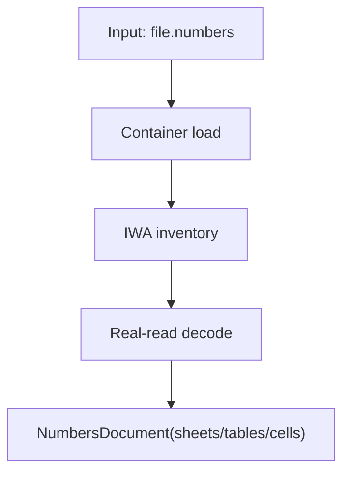

# Operation 5.1

[Back to Docs Hub](../index.md) | [Back to Capabilities](../capabilities.md) | [Operations Index](README.md)

### 5.1 `NumbersDocument.open(at:)`

**Purpose**

Open a `.numbers` file and build the read model.

**Signature**

```swift
static func open(at url: URL) throws -> NumbersDocument
```

**Attributes**

| Attribute | Type | Required | Notes |
|---|---|---|---|
| `url` | `URL` | Yes | Path to package or single-file archive `.numbers` |

**Returns**

- `NumbersDocument`

**Throws**

- container/path/archive parse errors
- malformed IWA parse failures

**Side Effects**

- none on disk

**Visual**



**Example**

```swift
let doc = try NumbersDocument.open(at: inputURL)
print(doc.sheets.count)
```

---


---

## Additional Notes

- This page is generated from the canonical operation section in [Capabilities](../capabilities.md).
- If API behavior changes, update the source operation card and regenerate operation pages.
