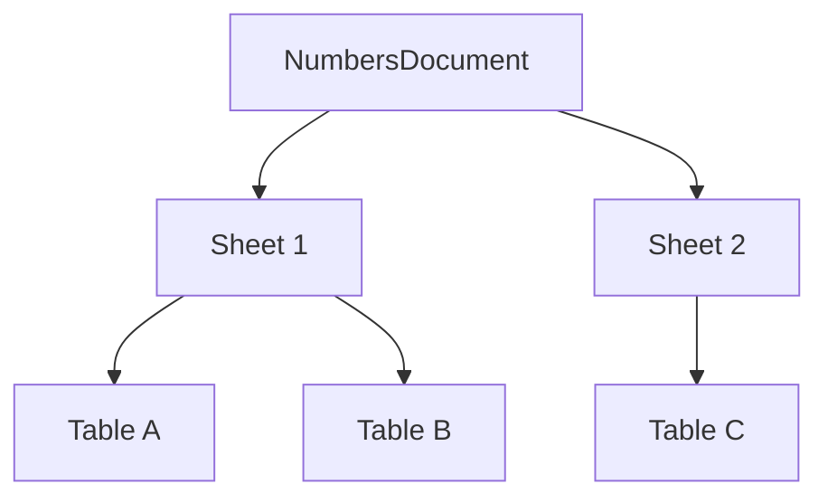

# Operation 5.2

[Back to Docs Hub](../index.md) | [Back to Capabilities](../capabilities.md) | [Operations Index](README.md)

### 5.2 `NumbersDocument.sheets`

**Purpose**

Access all sheets in read model order.

**Attributes**

| Attribute | Type | Required | Notes |
|---|---|---|---|
| `sheets` | `[Sheet]` | n/a | Read-only collection |

**Visual**



**Example**

```swift
for sheet in doc.sheets {
  print(sheet.name)
}
```

---


---

## Additional Notes

- This page is generated from the canonical operation section in [Capabilities](../capabilities.md).
- If API behavior changes, update the source operation card and regenerate operation pages.
