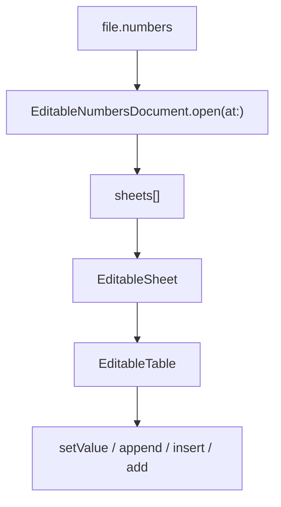

# Operation 5.7

[Back to Docs Hub](../index.md) | [Back to Capabilities](../capabilities.md) | [Operations Index](README.md)

### 5.7 `EditableNumbersDocument.open(at:)`

**Purpose**

Open a document in mutable mode.

**Signature**

```swift
static func open(at url: URL) throws -> EditableNumbersDocument
```

**Attributes**

| Attribute | Type | Required | Notes |
|---|---|---|---|
| `url` | `URL` | Yes | Existing `.numbers` path |

**Returns**

- editable document with mutation APIs

**Visual**



**Example**

```swift
let editable = try EditableNumbersDocument.open(at: inputURL)
print(editable.sheets.count)
```

---


---

## Additional Notes

- This page is generated from the canonical operation section in [Capabilities](../capabilities.md).
- If API behavior changes, update the source operation card and regenerate operation pages.
