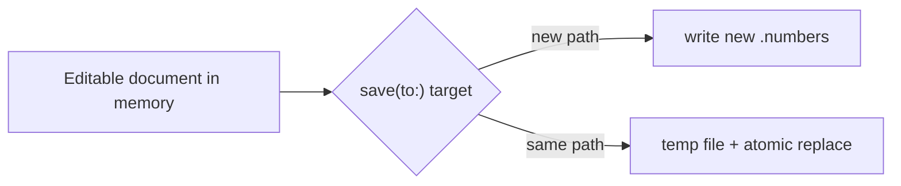

# Operation 5.16

[Back to Docs Hub](../index.md) | [Back to Capabilities](../capabilities.md) | [Operations Index](README.md)

### 5.16 `save(to:)`

**Purpose**

Persist all mutations to disk.

**Signature**

```swift
func save(to outputURL: URL) throws
```

**Attributes**

| Attribute | Type | Required | Notes |
|---|---|---|---|
| `outputURL` | `URL` | Yes | New destination or same-path in-place |

**Behavior**

- if `outputURL != sourceURL`: writes a new document
- if `outputURL == sourceURL`: performs atomic in-place replace
- if no changes and new path: copies source container

**Visual**



---


---

## Additional Notes

- This page is generated from the canonical operation section in [Capabilities](../capabilities.md).
- If API behavior changes, update the source operation card and regenerate operation pages.
