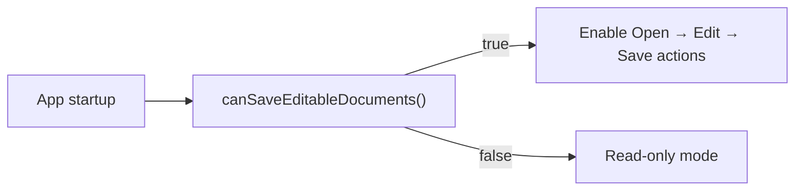

# Operation 5.20

[Back to Docs Hub](../index.md) | [Back to Capabilities](../capabilities.md) | [Operations Index](README.md)

### 5.20 `EditableNumbersDocument.canSaveEditableDocuments()`

**Purpose**

Runtime capability flag for write support availability.

**Signature**

```swift
static func canSaveEditableDocuments() -> Bool
```

**Attributes**

| Attribute | Type | Required | Notes |
|---|---|---|---|
| n/a | n/a | n/a | Static capability check |

**Returns**

- `Bool`

**Visual**



**Example**

```swift
guard EditableNumbersDocument.canSaveEditableDocuments() else {
  print("Write mode unavailable")
  return
}
```

---


---

## Additional Notes

- This page is generated from the canonical operation section in [Capabilities](../capabilities.md).
- If API behavior changes, update the source operation card and regenerate operation pages.
