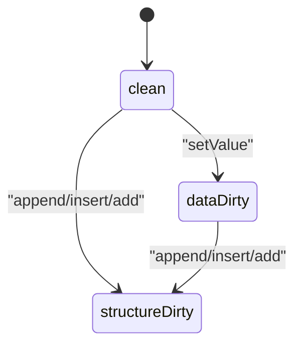

# Operation 5.21

[Back to Docs Hub](../index.md) | [Back to Capabilities](../capabilities.md) | [Operations Index](README.md)

### 5.21 `EditableNumbersDocument` state properties

**Purpose**

Observe in-memory edit state and sheet collection.

**Properties**

```swift
var sheets: [EditableSheet] { get }
var firstSheet: EditableSheet? { get }
var hasChanges: Bool { get }
var dirtyState: DocumentDirtyState { get }
```

**Attributes**

| Property | Type | Meaning |
|---|---|---|
| `sheets` | `[EditableSheet]` | Full mutable sheet list |
| `firstSheet` | `EditableSheet?` | Convenience accessor |
| `hasChanges` | `Bool` | `true` when edit journal is not empty |
| `dirtyState` | `DocumentDirtyState` | `clean` / `dataDirty` / `structureDirty` |

**Visual (state transition)**



**Example**

```swift
let doc = try EditableNumbersDocument.open(at: url)
print(doc.dirtyState.rawValue)  // clean
let table = try doc.sheet(named: "Sales").table(named: "Q1")
table.setValue(.number(42), at: .init(row: 1, column: 1))
print(doc.hasChanges)           // true
print(doc.dirtyState.rawValue)  // dataDirty
```

---


---

## Additional Notes

- This page is generated from the canonical operation section in [Capabilities](../capabilities.md).
- If API behavior changes, update the source operation card and regenerate operation pages.
